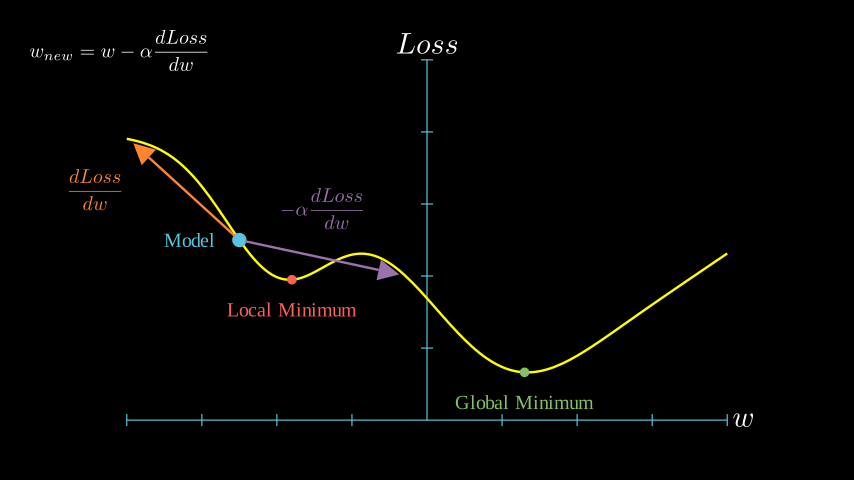
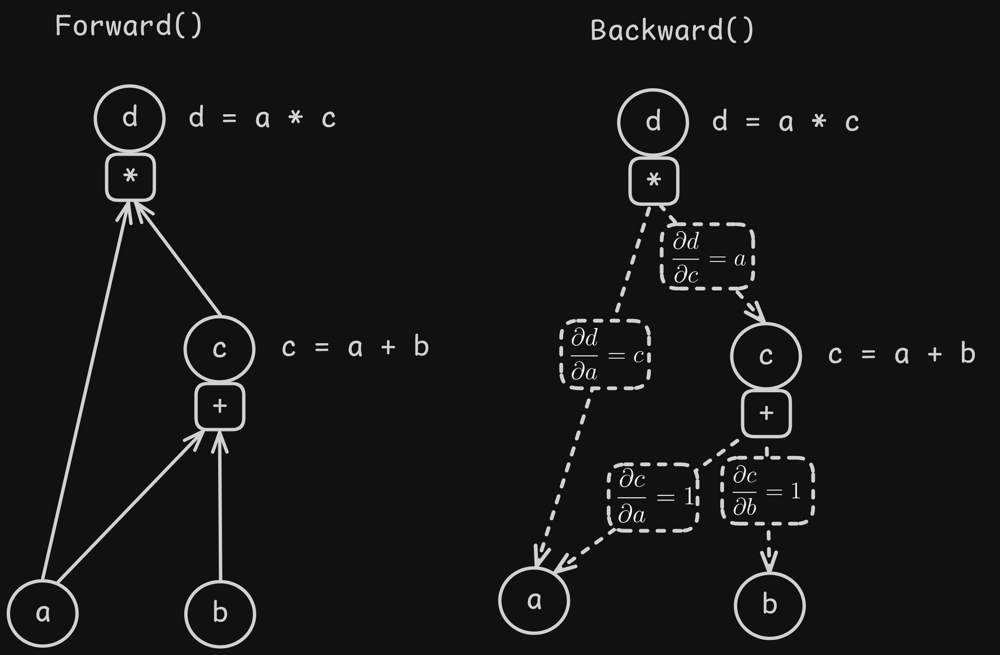
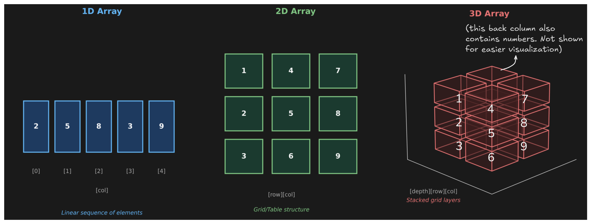

# SmolML - Core: Automatic Differentiation & N-Dimensional Arrays

Welcome to the **core** of **SmolML**! This is where the magic begins if you want to understand how machine learning models, especially neural networks, learn from data. We'll break down two fundamental concepts: how models *calculate* the direction for learning (**automatic differentiation**) and how we handle the **multi-dimensional data** involved.

This part of SmolML focuses on handling this data and calculating gradients automatically. What are gradients and why do we need them? Let's dive in.

## Why Do We Need Gradients Anyway?

Think about teaching a model to recognize a cat in a photo. The model makes a prediction based on its current internal settings (parameters or weights). Initially, these settings are random, so the prediction is likely wrong. We measure *how wrong* using a **loss function** (we have those in `smolml\utils\losses.py`): basically, *a lower loss means a better prediction*.

The goal is to adjust our computer's parameters to *minimize* this loss. But how do we know *which way* to adjust each parameter? Should we increase it? Decrease it? By how much?

<div align="center">



</div>

This is where **gradients** come in. The gradient of the loss function with respect to a specific parameter tells us the "slope" of the loss at that parameter's current value (orange arrow in the image above!). It points in the direction of the *steepest increase* in the loss. So, if we want to *decrease* the loss, we nudge the parameter in the *opposite* direction of the gradient multiplying by $-\alpha$, where $\alpha$ is our **learning rate** (this multiplication is represented in the purple arrow). Basically, if the gradient points to the left, we want our model to go to the right and vice-versa. That's why we use a negative learning rate! The size of the gradient also tells us how sensitive the loss is to that parameter: a larger gradient means a bigger adjustment might be needed.

A common problem in ML is models getting stuck in local minima while training, where the chosen learning rate isn't big enough to allow them to "leap" out of these suboptimal spots. This is bad! We want our model to reach the lowest possible loss (the global minimum). But if we choose a learning rate that's too big, we may overshoot this global minimum, or even bounce completely away from it. **Optimizers** were built to help tackle problems like this, and we'll see them in one of the next lessons (`smolml\utils\optimizers.py`).

In reality, we never train with just one weight as the image portraits, this is a super-simplified example. For each weight we add, the visualization increases by one dimension. So if we had 100 weights, we'd need to display that in a 101-dimensional plot (100 weights + 1 loss)!

For a loss function `J` with respect to weight parameter `w`, the **gradient** is mathematically expressed as:

$$
\frac{\partial J}{\partial w}
$$

As a summary, calculating these gradients for every parameter allows the model to iteratively improve, step-by-step, as moving in the opposite direction reduces the error. This process is the heart of training most ML models.

## Why "Automatic" Differentiation?

Let's think of a simple function like $y = a \times b + c$, we can find the gradients ($\frac{\partial y}{\partial a}$, $\frac{\partial y}{\partial b}$, $\frac{\partial y}{\partial c}$) using basic calculus rules (like the chain rule). You may remember some of this math from your highschool years.

But modern neural networks are *vastly* more complex. They are essentially giant, nested mathematical functions with potentially millions of parameters. Calculating all those gradients manually is practically impossible and incredibly prone to errors!

**Automatic Differentiation (AutoDiff)** is the solution. It's a **technique** where the computer itself keeps track of every single mathematical operation performed, building a computational graph. We will call this the `forward` phase, as information travels from the beggining to the end of the graph. Then, by applying the chain rule systematically backwards through this graph (a process called **backpropagation**), it can efficiently compute the gradient of the final output (the loss) with respect to every single input and parameter involved. We will call this the `backward` phase, take a look at the next image!

<div align="center">

  

</div>

As you can see in the previous image, we can use a **Directed Acyclic Graph** (DAG) where each node represents a value in our computation. The edges between nodes show us which values are used as inputs to compute other values, and what operation connects them (like addition, multiplication, etc.).

And now, we can apply the chain rule to automatically compute the gradient of our final output (shown as `d` in the image, which will be our **loss function** in our actual implementation) with respect to every single input and parameter in the entire graph. This gives us the exact information we need: *how much each variable needs to change to minimize our loss*.

> *(If you want a deep dive, the concept of backpropagation and automatic differentiation is greatly explained in this [Andrej Karpathy video](https://www.youtube.com/watch?v=VMj-3S1tku0), highly recommended!)*

## Implementing AutoDiff with `Value`

SmolML uses the `Value` class to implement Automatic Differentiation.

**What is a `Value`?**

There are several ways to implement this DAG structure. We'll be following the same `Value` class approach that Karpathy uses in his video, in order to have a foundation for our library. Don't worry, we will build the rest of the components by ourselves, but this serves as an awesome starting point!

Let's think about what each node in our DAG actually needs to keep track of. Looking back at the previous image, what information does each node hold? We need a class `Value` that can handle these four essential things:

1. Each node needs to remember the current **numerical result** of whatever computation it represents
2. We need to store how much this node contributes to the final value, which means, its **gradient with respect to the loss** (this will get filled in during backpropagation)
3. Each node should know what **mathematical operation** created it in order to correctly compute its gradient
4. Since we'll need to traverse backwards from the final output all the way to the original inputs during backpropagation, each node must **maintain links to the `Value` objects that were used to create it**

Think of a `Value` object as a smart container for a single number (a scalar). It doesn't just hold the number; it prepares for gradient calculations. It stores:
1.  `data`: The actual numerical value (e.g., 5.0, -3.2).
2.  `grad`: The gradient of the *final output* of our entire computation graph with respect to *this* specific `Value`'s data. It starts at 0 and gets filled during backpropagation.

> Can you build a class that does this? It does not need to be 100% implemented yet, but try to do a bit of a sketch. Remember we are showing the process in Python but you can do this in any language you want to! 

**Building the Calculation Trail (Computational Graph)**

The clever part happens when you perform mathematical operations (like `+`, `*`, `exp`, `tanh`, etc.) using `Value` objects. Each time you combine `Value` objects, you create a *new* `Value` object. This new object internally remembers:
* Its own `data` (the result of the operation).
* The operation that created it (`_op`).
* The original `Value` objects that were its inputs (`_children` or `_prev`).

This implicitly builds a computational graph, step-by-step, tracing the lineage of the calculation from the initial inputs to the final result. For example:

```python
a = Value(2.0)
b = Value(3.0)
c = Value(4.0)
# d 'knows' it resulted from a * b
d = a * b  # d._op = "*", d._prev = {a, b}
# y 'knows' it resulted from d + c
y = d + c  # y._op = "+", y._prev = {d, c}
```

**Backpropagation: Calculating Gradients Automatically**

So, how do we get the gradients without doing the calculus ourselves? We achieve this by calling the `.backward()` method on the final `Value` object (this final `Value` is the one that will represent our overall **loss**).

Let's backpropagate the small example from just before:

1. Start at the end (`y`). The gradient of `y` with respect to itself is 1. So, we set `y.grad = 1`.

2. `y` knows it came from `d + c`. Using the chain rule for addition ($\frac{\partial y}{\partial d} = 1$, $\frac{\partial y}{\partial c} = 1$), it passes its gradient back. It tells `d` to add `1 * y.grad` to its gradient, and tells `c` to add `1 * y.grad` to its gradient. So, `d.grad` becomes 1 and `c.grad` becomes 1.

3. `d` knows it came from `a * b`. Using the chain rule for multiplication ($\frac{\partial d}{\partial a} = b$, $\frac{\partial d}{\partial b} = a$), it passes its received gradient (`d.grad`) back. It tells `a` to add `b.data * d.grad` to its gradient, and tells `b` to add `a.data * d.grad` to its gradient. So `a.grad` becomes $3.0 \times 1 = 3.0$ and `b.grad` becomes $2.0 \times 1 = 2.0$.

4. This process continues recursively backwards through the graph until all `Value` objects that contributed to the final result have their gradients computed.

Each `Value` object stores a tiny function (`_backward`) that knows how to compute the local gradients for the operation it represents (+, *, tanh, etc.). The `.backward()` method orchestrates calling these small functions in the correct reverse order (using a topological sort) to implement the chain rule across the entire graph.

After calling `.backward()`, `a.grad`, `b.grad`, and `c.grad` hold the gradients, telling you exactly how sensitive the final output `y` is to changes in the initial inputs `a`, `b`, and `c`.

And that’s it! We now have an object that allows our models to learn efficiently. However, machine learning models don’t work with just one sample of data: they process thousands, sometimes even millions, of data instances. On top of that, this data often spans multiple dimensions. I wonder if there's a certain data structure that can help us with this problematic...

## Handling N-Dimensional Arrays of Values with `MLArray`

> **IMPORTANT NOTE**: `MLArray` is by far the most complex class of the library. If you are implementing this library by yourself while following along, I recommend just copying the provided `mlarray.py` for now, and make your own implementation at the end, as making it from scratch will probably take you a lot of time (and headaches!).

While `Value` objects handle the core AutoDiff for single numbers, machine learning thrives on vectors, matrices, and higher-dimensional tensors. We need an efficient way to manage collections of these smart Value objects. This is the job of the `MLArray` class.

What is an `MLArray`?

Think of `MLArray` as an N-dimensional array (like NumPy arrays! but built from scratch here). It can be a list (1D), a list-of-lists (2D matrix), or nested deeper for higher dimensions. As we are implementing it in Python, don't expect a high-performance implementation.

<div align="center">

  

</div>

The crucial difference from a standard Python list / list of lists is that every number you put into an MLArray is automatically converted into a `Value` object. This happens recursively in a `_process_data` method during initialization.

```python
# Creates a 2x2 MLArray; 1.0, 2.0, 3.0, 4.0 are now Value objects
my_matrix = MLArray([[1.0, 2.0], [3.0, 4.0]])
```

This ensures that any calculations performed using the `MLArray` will automatically build the computational graph needed for backpropagation.

**Operations on Arrays**

The idea of `MLArray` is to support many standard numerical operations, designed to work seamlessly with the underlying `Value` objects:

- **Element-wise operations**: `+`, `-`, `*`, `/`, `**` (power), `exp()`, `log()`, `tanh()`, etc. When you add two `MLArray`s, the library iterates through corresponding elements and performs the `Value.__add__` (or the corresponding operation, like `__mul__` for multiplication, and so on) operation on each pair (handled by `_element_wise_operation` function). This builds the graph element by element.
- **Matrix Multiplication**: `matmul()` or the `@` operator. This performs the dot product logic, correctly combining the underlying `Value` multiplications and additions to construct the appropriate graph structure.
- **Reductions**: `sum()`, `mean()`, `max()`, `min()`, `std()`. These operations aggregate `Value` objects across the array or along specified axes, again building the graph correctly.
- **Shape Manipulation**: `transpose()` (or `.T`), `reshape()`. These rearrange the `Value` objects into different array shapes without changing the objects themselves, preserving the graph connections.
- **Broadcasting**: Operations between arrays of different but compatible shapes (e.g., adding a vector to each row of a matrix) are handled automatically, figuring out how to apply operations element-wise based on broadcasting rules (`_broadcast_shapes`, `_broadcast_and_apply`).

Each of these operations has its own quirks and complications. If you want to build these by yourself, have patience and use NumPy as a reference to check if you're doing things right!

**Getting Gradients for Arrays**

Just like with a single `Value`, you can perform a complex sequence of `MLArray` operations. Typically, your final result will be a single scalar `Value` representing the loss (often achieved by using `.sum()` or `.mean()` at the end).

You then call `.backward()` on this final scalar `MLArray` (or the `Value` inside it). This triggers the backpropagation process through all the interconnected `Value` objects that were part of the calculation.

After `.backward()` has run, you can access the computed gradients for any `MLArray` involved in the original computation using its `.grad()` method. This returns a new `MLArray` of the same shape, where each element holds the gradient corresponding to the original `Value` object.

```python
# Example using ml_array.py and value.py

# Input data (e.g., batch of 2 samples, 2 features each)
x = MLArray([[1.0, 2.0], [3.0, 4.0]])
# Weights (e.g., simple linear layer mapping 2 features to 1 output)
w = MLArray([[0.5], [-0.5]])

# --- Forward Pass (Builds the graph) ---
# Matrix multiplication
z = x @ w
# Apply activation function (element-wise)
a = z.tanh()
# Calculate total loss (e.g., sum of activations)
L = a.sum() # L is now a scalar MLArray containing one Value

# --- Backward Pass (Calculates gradients) ---
L.backward() # Triggers Value.backward() across the graph

# --- Inspect Gradients ---
# Gradient of L w.r.t. each element in x
print("Gradient w.r.t. x:")
print(x.grad())
# Gradient of L w.r.t. each element in w
print("\nGradient w.r.t. w:")
print(w.grad())
```

**Utility Functions & Properties**

The library also includes some helpers within the `MLArray` class. If you want to build your own ML library it would be interesting to add them as well:

- `zeros()`, `ones()`, `randn()`: Create `MLArray`s filled with zeros, ones, or standard random numbers.
- `to_list()`: Convert an `MLArray` back to a standard Python list (this extracts the `.data` and discards gradient information).
- `shape`: A property to quickly get the dimensions tuple of the `MLArray`.
- `size()`: Returns the total number of elements in the `MLArray`.

## Putting It Together

With these two core components:

- A `Value` class that encapsulates a single number and enables automatic differentiation by tracking operations and applying the chain rule via backpropagation.
- An `MLArray` class that organizes these `Value` objects into N-dimensional arrays and extends mathematical operations (like matrix multiplication, broadcasting) to work seamlessly within the AutoDiff framework.

We have the essential toolkit to build and, more importantly, train various machine learning models, like simple neural networks, entirely from scratch. We can now define network layers, compute loss functions, and use the calculated gradients to update parameters and make our models learn!

[Next section: Linear Regression](https://github.com/rodmarkun/SmolML/tree/main/smolml/models/regression)