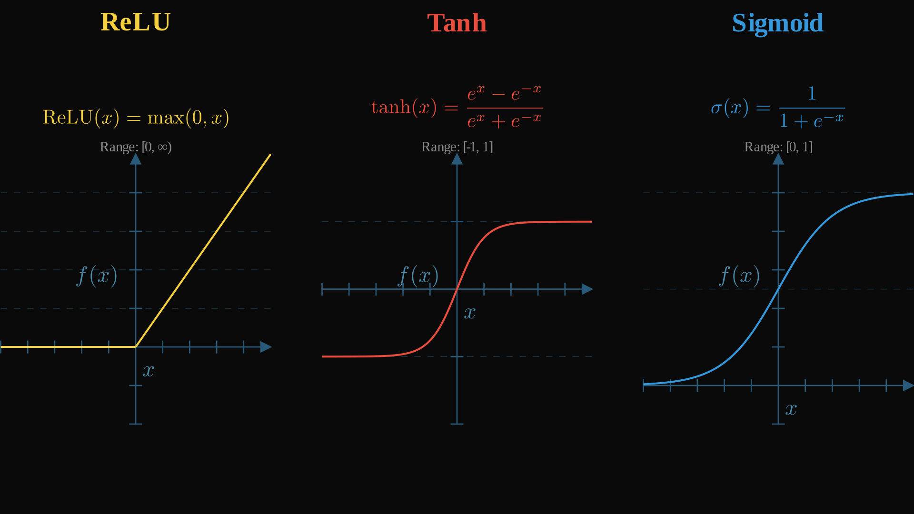

# SmolML - Neural Networks: Backpropagation to the limit

Welcome to the neural network section of SmolML! Having established our Value objects for automatic differentiation and MLArray for handling data (see the `smolml/core` section), we can now build models that learn. We saw how regression models applied these concepts in a simple way, but now we will take it a step further by implementing neural networks. This guide will walk you through the fundamental concepts, from a single neuron to a fully trainable neural network, and how they're represented in SmolML.

> **IMPORTANT - WARNING**: As our implementation is made fully in Python, handling the automatic differentiation of an entire neural network is very computationally expensive. If you plan on running an example, we recommend starting with a very small network and then escalate. Creating a too big neural network for your computer might make it freeze 🙂 

<div align="center">
  
</div>

My goal today is to make you understand all that's happening in the image above and to let you create it from scratch! Let's go element by element, starting with the most basic of them.

## The Neuron

At the heart of a neural network is the neuron (or node). Think of it as a small computational unit that receives several inputs, processes them, and produces a single output (if you've ever played Factorio, neural networks are just a fabric of converting some inputs into outputs).

<div align="center">
  
</div>

Here's what a neuron conceptually does:

Each input connection to the neuron has an associated **weight**. The neuron multiplies each **input value** by its corresponding **weight**. These weights are crucial: they are what the network learns by adjusting during training, determining the influence of each input.

The neuron then adds a **bias** term to this weighted sum. The **bias** allows the neuron to shift its output up or down, independent of its inputs. This helps the network fit data that doesn't necessarily pass through the origin.

So, for a series of inputs $x_1$, $x_2$, ..., $x_n$, our neuron applies the following formula to obtain an output `y`:

$$
y = w_1x_1 + w_2x_2 + ... + w_nx_n + b
$$

Remember what we did back in the `Regression` section? This is basically the same so far! We have a series of inputs, we multiply each one by a certain weight, and then we add a bias. But neurons do _something more_: 

The result of the weighted sum + bias is passed through an **activation function**. This function introduces **non-linearity**, which is vital. Without activation functions, our neural network would still only be able to learn linear relationships (essentially just a fancy linear regression). The **activation function** allows each neuron to capture complex, non-linear patterns in the data. 

<div align="center">

  

</div>

Common activation functions include `ReLU`, `Tanh`, and `Sigmoid`. We will implement them further on.

Each neuron in a network can be thought of as asking a question about the input data. For example, in an image classifier, one neuron might respond strongly to vertical edges, another to circular shapes, and another to specific color combinations. The weights determine what the neuron is looking for, the bias adjusts its sensitivity, and the activation function determines how it responds.

But a single neuron can't do much. That's why we group them into sequential units named **layers**. Each layer contains a number of neurons, and they push the outputs _forward_ until a final output is given. 

While SmolML doesn't have a standalone `Neuron` class for this section (as it's often more efficient to work with layers directly), the logic of many such neurons operating in parallel is encapsulated within our `DenseLayer`. Let's check it out.

## Layers: Organizing Neurons

As we already said, a single neuron isn't very powerful on its own. Neural networks organize neurons into **layers**. The most common type is a **Dense Layer** (also known as a _Fully Connected Layer_).

What does a `DenseLayer` do?

In a dense layer, every neuron in the layer receives input from every neuron in the previous layer (or from the raw input data if it's the first layer).

Think of it this way: instead of creating each neuron individually, and performing the formula for each one, we **create a matrix of weights** with an `MLArray`. In each column we store each neuron's weights (one for each input feature!) and each row represents a different neuron. Then, we can just perform matrix multiplication, add the bias array and finally apply our activation function. This might be too much info at once, so let's go step by step.

If you implemented the `Regression` models, you will find the `DenseLayer` a pretty easy build. 

The most notable difference is that _each_ neuron inside of our layer is essentially a unique linear regression. Each neuron has a list of _weights_ that **depend on the number of input features**. And each layer has a number of _neurons_ that **depend on the number of outputs we want it to have**. This sounds like a matrix to me!

Each neuron has a bias, so we will have an array of those with its length **based on the number of neurons**.

We will also need to define an **activation function** for our layer. In     [SmolML - The utility room!](https://github.com/rodmarkun/SmolML/tree/main/smolml/utils) section, we describe a few. If you're implementing along and don't wanna diverge too much, you can just use the ones we have _or_ create your own. Remember they need to be applied to each element inside an MLArray!

Now we have everything we need to initialize a `DenseLayer`!

```python
class DenseLayer:
    """
    Creates a standard Dense (linear) layer for a Neural Network.
    This layer performs the operation: output = activation(input @ weights + biases)
    """
    def __init__(self, input_size: int, output_size: int, activation_function: callable = activation.linear, 
                 weight_initializer: initializers.WeightInitializer = initializers.XavierUniform) -> None:
        """
        Initializes layer parameters: weights using the specified initializer and biases with zeros.
        Default activation is linear and default weight initialization is Xavier Uniform.
        """
        self.weights = weight_initializer.initialize(input_size, output_size)
        self.biases = zeros(1, output_size)  # Initialize biases with zeros
        self.activation_function = activation_function
```

   > NOTE: Yes, we are using initializers and optimizers here, which might be something you have not implemented yet. If you are implementing your own library, you are free to choose here: 1. Just use the implementation we provide and focus only in the current section. 2. Go to [SmolML - The utility room!](https://github.com/rodmarkun/SmolML/tree/main/smolml/utils) section, see how they are implemented and make your own!

The next step is creating the `forward()` method. It will take some input data and output the result from all the neurons. Can you guess the implementation before reading any further?

Method implementation:

```python
   def forward(self, input_data):
      """
      Performs the forward pass: applies linear transformation followed by activation function.
      """
      z = input_data @ self.weights + self.biases  # Linear transformation
      return self.activation_function(z)  # Apply activation function
```

The `forward()` method essentially defines how data flows through the layer. Because `input_data`, `self.weights`, and `self.biases` are `MLArray`s (which use `Value` objects internally), all operations automatically build the computational graph needed for backpropagation.

Finally, _how do we train this thing?_ _where does the `fit()` method go in here?_ Remember! This is a **layer** of a neural network! We will not be training this thing directly, instead, we will be **updating** its weights and biases based on the neural network's training (which contains several layers)!

```python
   def update(self, optimizer, layer_idx):
      """Update parameters using the provided optimizer"""
      self.weights, self.biases = optimizer.update(self, layer_idx, param_names=("weights", "biases"))
```

Great! That concludes our implementation of layers for now. Let's keep going to see how everything fits together in a **neural network**!

## Neural Networks: Stacking Layers

<div align="center">
  
</div>

The true power of neural networks comes from **stacking multiple layers**. The output of one layer becomes the input to the next. This allows the network to learn hierarchical features: earlier layers might learn simple patterns (like edges in an image), while later layers combine these to learn more complex concepts (like shapes or objects).


<div align="center">
  
</div>

As always, let's begin by thinking on _what_ do we need to initialize our `NeuralNetwork`.

We need a **list of `Layer`s** that will compose it, so that they can feed data `forward`. Of course, we will need a **loss function** to compute how off we are of real data. Finally, we will need an `Optimizer` to tell each of the layers how we want the weights and biases to change based on the gradients we got!

```python
class NeuralNetwork:
    """
    Implementation of a feedforward neural network with customizable layers and loss function.
    Supports training through backpropagation and gradient descent.
    """
    def __init__(self, layers: list, loss_function: callable, optimizer: optimizers.Optimizer = optimizers.SGD()) -> None:
        """
        Initializes the network with a list of layers and a loss function for training.
        """
        self.layers = layers
        self.loss_function = loss_function
        self.optimizer = optimizer if optimizer is not None else optimizers.SGD()
```

The `forward()` method is actually very simple, but has a small trick! Remember that the input to each layer must be the output of the previous layer! Or well, the input data directly in the case of the first layer.

```python
def forward(self, input_data):
   """
   Performs forward pass by sequentially applying each layer's transformation.
   """
   if not isinstance(input_data, MLArray):
      raise TypeError(f"Input data must be MLArray, not {type(input_data)}")
   for layer in self.layers:
      input_data = layer.forward(input_data)
   return input_data
```

This chained forward pass builds one large computational graph from the initial input all the way to the network's final prediction, since each layer's forward method uses `MLArray` operations.

## Teaching the Network: The Training Loop

"Learning" in a `NeuralNetwork` means adjusting the **weights** and **biases** in all its layers to make better predictions. This is achieved through a process called **training**, which typically involves the following steps repeated over many epochs (passes through the entire dataset):

1. **Forward Pass**:
   - Feed the input data (`X`) through the network using `network.forward(X)` to get predictions (`y_pred`). As we've seen, this also builds the computational graph.

2. **Compute Loss**:
   - Compare the network's predictions (`y_pred`) with the actual target values (`y`) using the specified loss_function (e.g., Mean Squared Error for regression, Cross-Entropy for classification).
   - The loss is a single Value (often wrapped in an `MLArray`) that quantifies how badly the network performed on this batch of data. This loss `Value` is the final node of our current computational graph.

3. **Backward Pass (Backpropagation)**:
   - This is where the magic of our `Value` objects (from the 'core' section) shines! We call `loss.backward()`.
   - This one command triggers the automatic differentiation process. It walks backwards through the entire computational graph (from the loss all the way back to every weight and bias in every `DenseLayer`, and even the input `X`) and calculates the gradient of the loss with respect to each of these `Value` objects. The `.grad` attribute of each `Value` (and thus each element in our `MLArray` parameters) is populated.
   - This tells us how much a small change in each `weight` or `bias` would affect the overall loss.

4. **Update Parameters**:
   - Now that we know the "direction of steepest ascent" for the loss (the gradients), the optimizer steps in. It uses these gradients (and its own internal logic, like a learning rate) to adjust the weights and biases in each layer. The goal is to nudge them in the opposite direction of their gradients to reduce the loss.
   - In SmolML, the `NeuralNetwork.train` method iterates through its layers and calls `layer.update(self.optimizer, ...)` for each. This method, in turn, uses the optimizer to modify layer.weights and layer.biases.

5. **Reset Gradients**:
   - The gradients calculated by `loss.backward()` are accumulated (added) to the `.grad` attribute of each `Value`. Before the next training iteration (the next forward/backward pass), it's absolutely crucial to reset these gradients back to zero.
   - This is done using the `.restart()` method on the relevant `MLArray`s (all weights and biases in every layer, and sometimes X and y if they are part of persistent graphs). If we didn't do this, gradients from previous iterations would incorrectly influence the updates in the current iteration.

```python
def train(self, X, y, epochs, verbose=True, print_every=1):
   """
   Trains the network using gradient descent for the specified number of epochs.
   Prints loss every 100 epochs to monitor training progress.
   """
   X, y = MLArray.ensure_array(X, y)
   losses = []
   for epoch in range(epochs):
      # STEP 1 - Forward pass through the network
      y_pred = self.forward(X)
      
      # STEP 2 - Compute loss between predictions and targets
      loss = self.loss_function(y_pred, y)
      losses.append(loss.data.data)
      
      # STEP 3 - Backward pass to compute gradients
      loss.backward()
      
      # STEP 4 - Update parameters in each layer
      for idx, layer in enumerate(self.layers):
            layer.update(self.optimizer, idx)
      
      # STEP 5 - Reset gradients for next iteration
      X.restart()
      y.restart()
      for layer in self.layers:
            layer.weights.restart()
            layer.biases.restart()
            
      # This is just for a verbose output
      if verbose:
            if (epoch+1) % print_every == 0:
               print(f"Epoch {epoch + 1}/{epochs}, Loss: {loss.data}")

   return losses
```

By repeatedly cycling through these steps, the NeuralNetwork gradually tunes its `DenseLayer` parameters, using the automatic differentiation power of `Value` and `MLArray` to minimize the loss and learn from data!

Now you can go back to the first image of this section and everything will seem way more clear now :)


## Run tests!

Feel free to run `tests/neural_network_tests.py` to see a comparison of our newly implement `NeuralNetwork` model against [TensorFlow](https://www.tensorflow.org/) and [PyTorch](https://pytorch.org/)! It will trigger all examples described in the "_Example Usage_" subsection. As I said at the beginning of this section, **be wary of making a `NeuralNetwork` too big, as it is not optimized at all and will demand a lot from your computer**. 

The test will generate some plots for each test comparing all models. Change the parameters of the test as you will, or try it with other datasets and against other frameworks!

## Example Usage

Here's how you can use the `NeuralNetwork` class to solve different types of problems:

### XOR Problem

The XOR problem is a classic non-linear classification task that demonstrates why neural networks need multiple layers and activation functions:

```python
from smolml.models.nn import NeuralNetwork, DenseLayer
from smolml.core.ml_array import MLArray
import smolml.utils.optimizers as optimizers
import smolml.utils.losses as losses
import smolml.utils.activation as activation

# XOR training data
# XOR is True when inputs differ: (0,0)→0, (0,1)→1, (1,0)→1, (1,1)→0
X_data = [[0.0, 0.0], [0.0, 1.0], [1.0, 0.0], [1.0, 1.0]]
y_data = [[0.0], [1.0], [1.0], [0.0]]

# Convert to MLArray
X = MLArray(X_data)
y = MLArray(y_data)

# Create a simple 2-layer network
# Input layer: 2 features
# Hidden layer: 416 neurons with ReLU activation
# Output layer: 1 neuron with tanh activation
model = NeuralNetwork(
    layers=[
        DenseLayer(input_size=2, output_size=16, activation_function=activation.relu),
        DenseLayer(input_size=16, output_size=1, activation_function=activation.tanh)
    ],
    loss_function=losses.mse_loss,
    optimizer=optimizers.AdaGrad(learning_rate=0.1)
)

# Print initial model architecture
print(model)

# Train the network
print("\nTraining XOR network...")
losses_history = model.train(X, y, epochs=100, verbose=True, print_every=100)
print("Training complete!")

# Make predictions
print("\nPredictions:")
for i, x_sample in enumerate(X_data):
    prediction = model.forward(MLArray([x_sample]))
    print(f"Input: {x_sample} → Predicted: {prediction.to_list()[0][0]:.4f}, "
          f"Actual: {y_data[i][0]}")
```

### Binary Classification

Here's a more realistic example with a binary classification problem using two features:

```python
from smolml.models.nn import NeuralNetwork, DenseLayer
from smolml.core.ml_array import MLArray
import smolml.utils.optimizers as optimizers
import smolml.utils.losses as losses
import smolml.utils.activation as activation
from sklearn.datasets import make_moons

# Generate simple non-linear classification data using sklearn
X_data, y_data = make_moons(n_samples=100, noise=0.1, random_state=42)

# Convert to the format expected by SmolML
X_data = X_data.tolist()
y_data = [[float(y)] for y in y_data]  # Convert to 2D list with shape (n_samples, 1)

# Convert to MLArray
X = MLArray(X_data)
y = MLArray(y_data)

# Create a deeper network for better decision boundaries
model = NeuralNetwork(
    layers=[
        DenseLayer(input_size=2, output_size=16, activation_function=activation.relu),
        DenseLayer(input_size=16, output_size=8, activation_function=activation.relu),
        DenseLayer(input_size=8, output_size=1, activation_function=activation.sigmoid)
    ],
    loss_function=losses.binary_cross_entropy,
    optimizer=optimizers.Adam(learning_rate=0.01)
)

print(model)

# Train with fewer epochs due to larger network
print("\nTraining binary classifier on moons dataset...")
losses_history = model.train(X, y, epochs=100, verbose=True, print_every=20)

# Test predictions on some points
X_test = MLArray([[-1.0, 0.5], [1.0, -0.5], [0.0, 0.0]])
print("\nTest predictions:")
for x_sample in X_test.to_list():
    pred = model.forward(MLArray([x_sample]))
    class_pred = "Class 1" if pred.to_list()[0][0] > 0.5 else "Class 0"
    print(f"Input: {x_sample} → Prediction: {pred.to_list()[0][0]:.4f} ({class_pred})")
```

### Multi-Output Regression

Neural networks can also handle multiple output values simultaneously:

```python
from smolml.models.nn import NeuralNetwork, DenseLayer
from smolml.core.ml_array import MLArray
import smolml.utils.optimizers as optimizers
import smolml.utils.losses as losses
import smolml.utils.activation as activation
from sklearn.datasets import load_iris
from sklearn.preprocessing import StandardScaler

# Load the famous Iris dataset
# 4 features: sepal length, sepal width, petal length, petal width
# 3 classes: setosa, versicolor, virginica
iris = load_iris()
X_data = iris.data  # Shape: (150, 4)
y_data = iris.target  # Shape: (150,)

# Normalize features for better training
scaler = StandardScaler()
X_data = scaler.fit_transform(X_data)

# Convert labels to one-hot encoding for multi-class classification
# e.g., class 0 -> [1, 0, 0], class 1 -> [0, 1, 0], class 2 -> [0, 0, 1]
y_onehot = []
for label in y_data:
    one_hot = [0.0, 0.0, 0.0]
    one_hot[label] = 1.0
    y_onehot.append(one_hot)

# Convert to lists for SmolML
X_data = X_data.tolist()
y_data = y_onehot

# Convert to MLArray
X = MLArray(X_data)
y = MLArray(y_data)

# Create network with 3 outputs (one for each class)
model = NeuralNetwork(
    layers=[
        DenseLayer(input_size=4, output_size=16, activation_function=activation.relu),
        DenseLayer(input_size=16, output_size=8, activation_function=activation.relu),
        DenseLayer(input_size=8, output_size=3, activation_function=activation.softmax)
    ],
    loss_function=losses.categorical_cross_entropy,
    optimizer=optimizers.Adam(learning_rate=0.01)
)

print(model)

print("\nTraining multi-class classifier on Iris dataset...")
losses_history = model.train(X, y, epochs=100, verbose=True, print_every=20)

# Make predictions on a few test samples
print("\nTest predictions:")
test_indices = [0, 50, 100]  # One from each class
class_names = iris.target_names

for idx in test_indices:
    X_test = MLArray([X_data[idx]])
    prediction = model.forward(X_test)
    pred_probs = prediction.to_list()[0]
    pred_class = pred_probs.index(max(pred_probs))
    actual_class = iris.target[idx]
    
    print(f"\nSample {idx}:")
    print(f"  Features: {[f'{x:.2f}' for x in X_data[idx]]}")
    print(f"  Predicted probabilities: {[f'{p:.3f}' for p in pred_probs]}")
    print(f"  Predicted class: {class_names[pred_class]}")
    print(f"  Actual class: {class_names[actual_class]}")
```