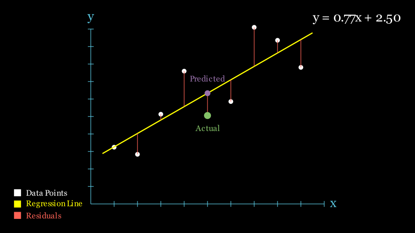
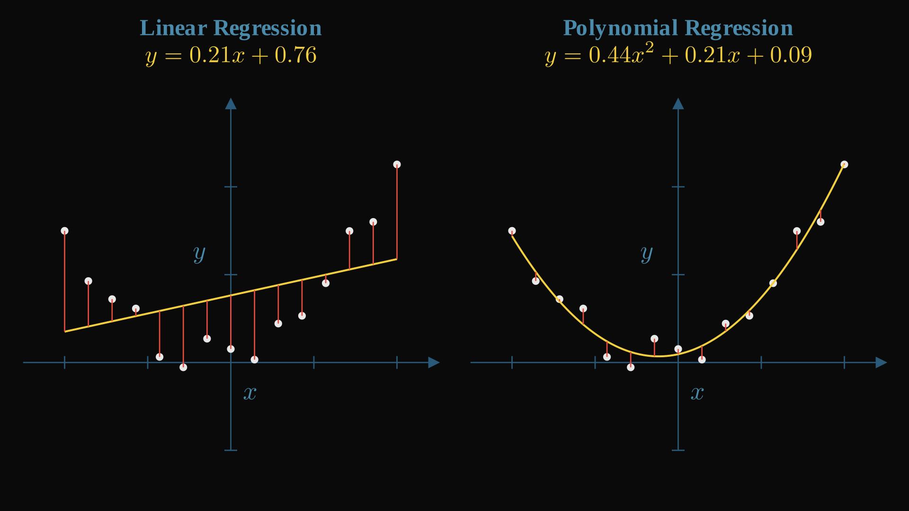

# SmolML - Regression: Predicting Continuous Values

Building upon the core concepts of automatic differentiation (`Value`) and N-dimensional arrays (`MLArray`) explained in the [SmolML Core](https://github.com/rodmarkun/SmolML/tree/main/smolml/core), we can now implement various machine learning models! This section focuses on **regression models**, which are used to predict continuous numerical outputs. Think of predicting house prices, stock values, or temperature based on input features.

While deep neural networks offer immense power, simpler models like **Linear Regression** or its extension, **Polynomial Regression**, are often excellent starting points, computationally efficient, and highly interpretable. They share the same fundamental learning principle as complex networks: minimizing a loss function by adjusting parameters using gradient descent, all powered by our automatic differentiation engine using the `Value` class. We will use them as a small testing ground for the classes we have just implemented!

## Regression Fundamentals: Learning from Data

The goal in regression is to find a mathematical function that maps input features (like the square footage of a house) to a continuous output (like its price). This function has internal parameters (often called **weights** or coefficients, and a **bias** or intercept) that determine its exact shape.

<div align="center">

  

</div>
But how does it actually *predict* values?

When predicting values, regression models use a formula like this one:

$$
y = wx+b
$$

Where `w` is the **weight** and `b` is the **bias**. You may have encountered a formula like this one before, it is just the formula of a straight line! Where `w` is the slope, and `b` is the offset or y-intercept.

But wait! This formula only works with a *single input feature* ($x$). What if we want to account for square footage ($x_1$), number of bedrooms ($x_2$) and distance to the city center ($x_3$)?

In that case, we add a weight for each input feature, giving us:

$$
y = w_1x_1 + w_2x_2 + w_3x_3 + b
$$

This is the formula our regression model will use to predict values.

 > *(I highly recommend to [check out this deep-dive into Linear Regression by MLU-Explain](https://mlu-explain.github.io/linear-regression/), it's very visual!)*

How do we find the *best* parameters (**weights** and **bias** in this case) to make our predictions as accurate as possible?
1.  **Prediction:** We start with initial (often random) parameters and use the model to make predictions on our training data.
2.  **Loss Calculation:** We compare these predictions to the actual known values using a **loss function**. This function quantifies *how wrong* the model currently is.
3.  **Gradient Calculation:** Just like in the core explanation, we need to know how to adjust each parameter to reduce the loss. We will use our `Value` objects and the concept of **backpropagation** to automatically calculate the **gradient** of the loss with respect to each parameter (**weights** and **bias**). Remember, the gradient points towards the steepest *increase* in loss, so we move to the other side!.
4.  **Parameter Update:** We use an **optimizer** to nudge the parameters in the *opposite* direction of their gradients, taking a small step towards lower loss.
5.  **Iteration:** We repeat steps 1-4 many times (iterations or epochs), gradually improving the model's parameters until the loss is greatly minimized or stops decreasing significantly.

This iterative process allows the regression model to "learn" the underlying relationship between the inputs and outputs from the data.

## The `Regression` Base Class

To streamline the implementation of different regression algorithms, in SmolML we will make a `Regression` base class (in `regression.py`). This class handles the common structure and the training loop logic, and it will be the foundation for all of our regression models. Specific models like `LinearRegression` or `PolynomialRegression` (different kinds of regression) will inherit from it.

First off, our model needs to know **how many input features** we're working with from the beginning in order to initialize the correct number of weights. We'll also need a **loss function** for calculating *how wrong we are*. Finally, we'll use an **optimizer** and an **initializer**, just like with all our models. This is a design choice from the library, you can implement both directly in the model class.

Next, we need to define a `fit()` method that trains the network based on the input features `X` and the true values `y` (which are `MLArrays`!) for a certain number of `iterations`. We'll also need a `restart()` to reset all gradients in our model (`MLArray` has a method for that, check it out!) 

Finally, we need a `predict()` method for making predictions based on an input `X`. Since we're just implementing a placeholder class that specific models will inherit from, you can throw a `NotImplementedError` whenever this is called. We'll implement the actual logic in each specific model.

Try to build something like this by yourself before reading further! (It does not need to be functional yet, but try to *fit* all of this together).

Here's how we fit all of that in the implementation:

* **Initialization (`__init__`)**:
    * Accepts the `input_size` (number of expected input features), a `loss_function`, an `optimizer` instance, and a weight `initializer`.
    * Crucially, it initializes the model's **trainable parameters**:
        * `self.weights`: An `MLArray` holding the coefficients for each input feature. Its shape is determined by `input_size`, and values are set by the `initializer`.
        * `self.bias`: A scalar `MLArray` (initialized to 1) representing the intercept term.
    * Because `weights` and `bias` are `MLArray`s, they inherently contain `Value` objects. This ensures they are part of the computational graph and their gradients can be automatically computed during training.

    ```python
        def __init__(self, input_size: int, loss_function: callable = losses.mse_loss, optimizer: optimizers.Optimizer = optimizers.SGD, initializer: initializers.WeightInitializer = initializers.XavierUniform):
            """
            Initializes base regression model with common parameters.
            """
            self.input_size = input_size
            self.loss_function = loss_function
            self.optimizer = optimizer
            self.initializer = initializer
            self.weights = self.initializer.initialize((self.input_size,))
            self.bias = ml_array.ones((1))
    ```

    > NOTE: Yes, we are using initializers and optimizers here, which might be something you have not implemented yet. If you are implementing your own library, you are free to choose here: 1. Just use the implementation we provide and focus only in the current section. 2. Go to [SmolML - The utility room!](https://github.com/rodmarkun/SmolML/tree/main/smolml/utils) section, see how they are implemented and make your own!

* **Training (`fit`)**:
    * This method orchestrates the gradient descent loop described earlier. For a specified number of `iterations`:
        1.  **Forward Pass:** Calls `self.predict(X)` (which must be implemented by the subclass) to get predictions `y_pred`. This builds the computational graph for the prediction step.
        2.  **Loss Calculation:** Computes `loss = self.loss_function(y, y_pred)`. This `loss` is the final `MLArray` (usually containing a single `Value`) representing the overall error for this iteration.
        3.  **Backward Pass:** Invokes `loss.backward()`. This triggers the automatic differentiation process, calculating the gradients of the loss with respect to all involved `Value` objects, including those within `self.weights` and `self.bias`.
        4.  **Parameter Update:** Uses `self.optimizer.update(...)` to adjust `self.weights` and `self.bias` based on their computed gradients (`weights.grad()` and `bias.grad()`) and the optimizer's logic (e.g., learning rate).
        5.  **Gradient Reset:** Calls `self.restart(X, y)` to zero out all gradients (`.grad` attributes of the `Value` objects) in the parameters and data, preparing for the next iteration.


    ```python
        def fit(self, X, y, iterations: int = 100, verbose: bool = True, print_every: int = 1):
            """
            Trains the regression model using gradient descent.
            """
            X, y = MLArray.ensure_array(X, y)
            losses = []
            for i in range(iterations):
                # Make prediction 
                y_pred = self.predict(X)
                # Compute loss
                loss = self.loss_function(y, y_pred)
                losses.append(loss.data.data)
                # Backward pass
                loss.backward()

                # Update parameters
                self.weights, self.bias = self.optimizer.update(self, self.__class__.__name__, param_names=("weights", "bias"))

                # Reset gradients
                X, y = self.restart(X, y)

                if verbose:
                    if (i+1) % print_every == 0:
                        print(f"Iteration {i + 1}/{iterations}, Loss: {loss.data}")

            return losses
    ```

* **Prediction (`predict`)**:
    * Defined in the base class but raises `NotImplementedError`. Why? Because the core logic of *how* to make a prediction differs between regression types (e.g., linear vs. polynomial). Each subclass *must* provide its own `predict` method defining its specific mathematical formula using `MLArray` operations.

    ```python
        def predict(self, X):
            """
            Abstract method for making predictions.
            Must be implemented by specific regression classes.
            """
            raise NotImplementedError("Regression is only base class for Regression algorithms, use one of the classes that inherit from it.")
    ```

* **Gradient Reset (`restart`)**:
    * A helper that simply calls the `.restart()` method on the `weights`, `bias`, input `X`, and target `y` `MLArray`s. This efficiently resets the `.grad` attribute of all underlying `Value` objects to zero.

    ```python
        def restart(self, X, y):
            """
            Resets gradients for all parameters and data for next iteration.
            """
            X = X.restart()
            y = y.restart()
            self.weights = self.weights.restart()
            self.bias = self.bias.restart()
            return X, y
    ```

* **Representation (`__repr__`)**:
    * Provides a nicely formatted string summary of the configured model, including its type, parameter shapes, optimizer, loss function, and estimated memory usage. This implementation is not mandatory, but helps with debugging and giving information.

## Specific Models Implemented

<div align="center">

  

</div>

### `LinearRegression`

This is the most fundamental regression model. It assumes a direct linear relationship between the input features `X` and the output `y`. The goal is to find the best weights `w` and bias `b` such that $y \approx Xw + b$.

We already have everything we need for this model! The only thing we must implement is the `predict()` method. And we already discussed the formula:

$$
y = w_1x_1 + w_2x_2 + ... + w_ix_i + b
$$

Where `i` is our number of features. When first looking at this formula, how do you think we should handle the $w_ix_i$ part? Maybe a `for` loop where we multiply each weight by each input?

No need! Remember all `x` values and all `w` values are each in their own `MLArray`. Knowing this, we can just use **matrix multiplication** `@` to compute it!

```python
   def predict(self, X):
       """
       Makes predictions using linear model equation.
       """
       if not isinstance(X, MLArray):
            raise TypeError(f"Input data must be MLArray, not {type(X)}")
       return X @ self.weights + self.bias
```

It takes the input `X` (`MLArray`), performs matrix multiplication (`@`) with `self.weights` (`MLArray`), and adds `self.bias` (`MLArray`). Because `X`, `weights`, and `bias` are all `MLArray`s containing `Value` objects, this single line of code automatically constructs the necessary computational graph for backpropagation, which we use in `fit()`!

And that's it! We now have a working linear regression model. Feel free to experiment with it in the `tests/regression_tests.py` and add fit some toy problems! Let's try now to implement a more complex model, the `PolynomialRegression` one.

### `PolynomialRegression`

In reality, data *usually* is not represented by a straight line. In these cases, we can use **Polynomial Regression**. Polynomial Regression extends linear regression by fitting a polynomial curve to the data. For example:

$$y \approx w_2 x^2 + w_1 x + b$$

One aspect of our equation to take into account is the **degree**. The degree will be the highest number to which each of our features (x) is powered to. Despite being more accurate, one disadvantage of this regression type is its scaling complexity whenever we add more features. Take a look at this two-features example:

$$y \approx w_1​x_1​+w_2​x_2​+w_3​x_1^2​+w_4​x_2^2​+w_5​x_1​x_2​+b$$

As you can see, the equation grows significantly more complex as we increase the degree. The number of terms grows **polynomially** with the number of features (specifically, it follows the formula for **combinations with replacement**). This causes polynomial regression to be somewhat unstable, especially for higher-degree polynomials, we will see this later in the tests!

For the implementation, we'll use our `Regression` class as a base and make some modifications to create our `PolynomialRegression`.

The main operation we need to implement is a way to calculate each **term** of the equation based on the original *number of features* and the specified *degree*. Each of these terms will become our **new features**. In the equation above, we'd have the following terms or features:
- $x_1$
- $x_2$
- $x_1x_1 = x_1²$
- $x_2x_2 = x_2²$
- $x_1x_2$

The key for calculating this is in the `generate_combinations` method (this one could be a leetcode problem!).This method calculates all combinations of feature indices up to a given degree, so we can easily create these features. For example, for 2 features and degree 2, we'd output: `[[0], [1], [0,0], [0,1], [1,1]]`. If our features are [$x_1$, $x_2$​], we'd have the recipe for creating all the terms from above!

Try creating a function that uses recursion to generate outputs like these based on the number of features and degree.

In our case, we implemented it like this:

```python
def generate_combinations(self, n_features: int, degree: int):
    """
    Generate all combinations of feature indices up to given degree.
    For 2 features and degree 2: [[0], [1], [0,0], [0,1], [1,1]]
    """
    result = []
    def obtain_combination(curr_combination, remaining_degree, min_idx):
        if remaining_degree == 0:
            result.append(curr_combination)
            return
        
        for i in range(min_idx, n_features):
            obtain_combination(curr_combination + [i], remaining_degree - 1, i)
        
    for d in range(1, degree + 1):
        obtain_combination([], d, 0)
        
    return result
```

The total number of new features will be the length of the output from the previous function:

```python
def _calculate_num_features(self, n_features, degree):
    """
    Calculate number of polynomial features.
    """
    return len(self.generate_combinations(n_features, degree))
```

And this is the number of features we'll use to initialize our original `Regression` class!

```python
def __init__(self, input_size: int, degree: int, loss_function: callable = losses.mse_loss, optimizer: optimizers.Optimizer = optimizers.SGD, initializer: initializers.WeightInitializer = initializers.XavierUniform):
    """
    Initializes polynomial model with degree and training parameters.
    """
    self.original_input_size = input_size  # Store the original number of features
    self.degree = degree
    
    # Calculate number of polynomial features (including interactions)
    num_poly_features = self._calculate_num_features(input_size, degree)
    
    # Initialize with the total number of polynomial features
    super().__init__(num_poly_features, loss_function, optimizer, initializer)
```

Now we need a method to actually transform our inputs (for whenever we try to predict something) based on the output of `generate_combinations`. We achieve this in the `transform_features` method:

```python
def transform_features(self, X):
    """
    Creates polynomial features up to specified degree including interactions.
    For input X with 2 features and degree 2:
    - Input: [[x1, x2]]
    - Output: [[x1, x2, x1^2, x1*x2, x2^2]]
    """
    if not isinstance(X, MLArray):
        X = MLArray(X)
        
    n_samples = X.shape[0]
    n_features = X.shape[1] if len(X.shape) > 1 else 1
    
    feature_combinations =self.generate_combinations(n_features, self.degree)
    
    new_data = []
    for sample_idx in range(n_samples):
        sample_poly_features = []
        
        for comb in feature_combinations:
            feature_value = MLArray(1.0)
            
            for feature_idx in comb:
                if len(X.shape) > 1:
                    feature_val = X.data[sample_idx][feature_idx]
                else:
                    feature_val = X.data[sample_idx]
                    
                feature_value *= feature_val
            
            sample_poly_features.append(feature_value.data if isinstance(feature_value, MLArray) else feature_value)
            
        new_data.append(sample_poly_features)
        
    return MLArray(new_data)
```

Finally! The only thing left is incorporating `transform_features` into our `predict` method. Since `predict` is already used inside the `fit` method, we don't need to change `fit`, it will automatically work with what we implemented in the `Regression` base class!

```python
def predict(self, X):
    """
    Makes predictions after transforming features to polynomial form.
    """
    if not isinstance(X, MLArray):
            raise TypeError(f"Input data must be MLArray, not {type(X)}")
    X_poly = self.transform_features(X)
    return X_poly @ self.weights + self.bias
```

And that's it! We can now use `PolynomialRegression` to fit non-linear data! 

## Run tests!

Feel free to run `tests/regression_tests.py` to see how these regression models work with some random toy data! Each execution is different, so run them several times. You can see how we fit the data epoch by epoch using the interactive slider.

As you'll see, sometimes `PolynomialRegression`'s higher-degree examples have an exploding loss instead of a minimizing one! This is because polynomial regression is way more sensitive to random weight initialization, feature magnitudes, and learning rate changes.

Higher polynomial terms amplify bad initialization: if $w_2$ starts too large, then $w_2x^2$ can quickly explode. We'll stop with regression here, but feel free to research how to control and minimize these explosions. For now, let's move on to a more powerful model: Neural Networks!

## Example Usage

Here's a conceptual example of how you might use `LinearRegression`:

```python
from smolml.models.regression import LinearRegression
from smolml.core.ml_array import MLArray
import smolml.utils.optimizers as optimizers
import smolml.utils.losses as losses

# Sample Data (e.g., 2 features, 3 samples)
X_data = [[1.0, 2.0], [2.0, 3.0], [3.0, 4.0]]
# Target values (continuous)
y_data = [[3.5], [5.5], [7.5]]

# Convert to MLArray
X = MLArray(X_data)
y = MLArray(y_data)

# Initialize the model
# Expects 2 input features
model = LinearRegression(input_size=2,
                         optimizer=optimizers.SGD(learning_rate=0.01),
                         loss_function=losses.mse_loss)

# Print initial model summary
print(model)

# Train the model
print("\nStarting training...")
losses_history = model.fit(X, y, iterations=100, verbose=True, print_every=10)
print("Training complete.")

# Print final model summary (weights/bias will have changed)
print(model)

# Make predictions on new data
X_new = MLArray([[4.0, 5.0]])
prediction = model.predict(X_new)
print(f"\nPrediction for {X_new.to_list()}: {prediction.to_list()}")
```

And this is the usage of `PolynomialRegression`:

```python
from smolml.models.regression import PolynomialRegression
from smolml.core.ml_array import MLArray, randn
import smolml.utils.optimizers as optimizers
import smolml.utils.losses as losses
import smolml.utils.initializers as initializers

# Generate non-linear sample data (e.g., quadratic relationship)
# y ≈ 2x² + 3x + 1 + noise
X_data = [[-2.0], [-1.0], [0.0], [1.0], [2.0]]
y_data = [[3.0], [0.5], [1.0], [6.0], [15.0]]

# Convert to MLArray
X = MLArray(X_data)
y = MLArray(y_data)

# Initialize polynomial regression model with degree 2
# This will create features: [x, x²]
model = PolynomialRegression(
    input_size=1,
    degree=2,
    optimizer=optimizers.SGD(learning_rate=0.05),
    loss_function=losses.mse_loss,
    initializer=initializers.XavierUniform()
)

# Print initial model summary
print(model)

# Train the model
print("\nStarting training...")
losses_history = model.fit(X, y, iterations=200, verbose=True, print_every=20)
print("Training complete.")

# Print final model summary
print(model)

# Make predictions on new data
X_new = MLArray([[3.0]])
prediction = model.predict(X_new)
print(f"\nPrediction for {X_new.to_list()}: {prediction.to_list()}")

# Example with multiple features and interactions
# Generate 2-feature data: y = 2x₁ + 3x₂ + x₁² + x₁x₂ + noise
# For 2 features with degree 2, it creates: [x₁, x₂, x₁², x₁x₂, x₂²]
import numpy as np

X_1 = randn(30, 1)
X_2 = randn(30, 1)

X_data = []
y_data = []
for i in range(30):
    x1 = X_1.data[i][0].data
    x2 = X_2.data[i][0].data
    X_data.append([x1, x2])
    y_val = 2*x1 + 3*x2 + x1*x1 + x1*x2 + np.random.randn()*0.1
    y_data.append([y_val])

X_multi = MLArray(X_data)
y_multi = MLArray(y_data)

model_multi = PolynomialRegression(
    input_size=2,
    degree=2,
    optimizer=optimizers.SGD(learning_rate=0.05),
    loss_function=losses.mse_loss,
    initializer=initializers.XavierUniform()
)

print("\n" + "="*50)
print("Training multi-feature polynomial regression...")
print(model_multi)
model_multi.fit(X_multi, y_multi, iterations=200, verbose=True, print_every=20)

X_test = MLArray([[1.5, 2.0]])
pred_multi = model_multi.predict(X_test)
print(f"\nPrediction for {X_test.to_list()}: {pred_multi.to_list()}")
```

And that's it! We now have a couple of simple models that can learn from data. Now, what if we go to something a bit... *deeper*?

[Next Section: Neural Networks](https://github.com/rodmarkun/SmolML/tree/main/smolml/models/nn)

## Resources & Readings

- [Linear Regression - A Visual Introduction To (Almost) Everything You Should Know](https://mlu-explain.github.io/linear-regression/)
- [NeuralNine Video - Linear Regression From Scratch in Python (Mathematical)](https://www.youtube.com/watch?v=VmbA0pi2cRQ)