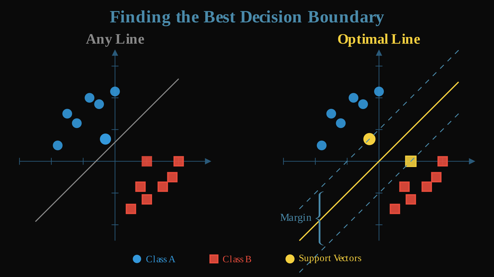
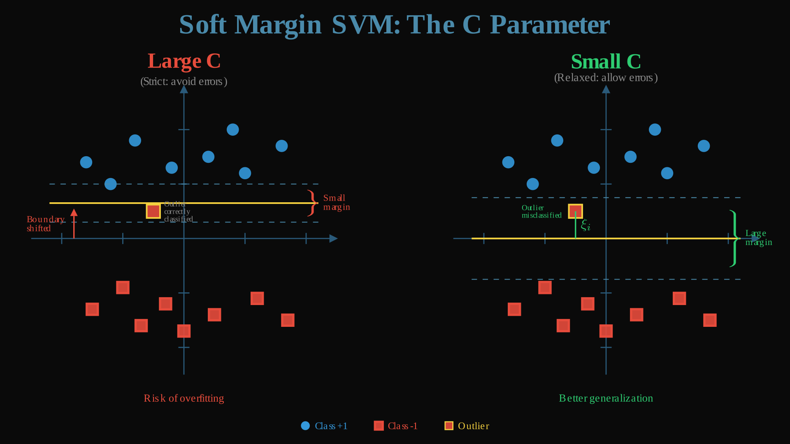
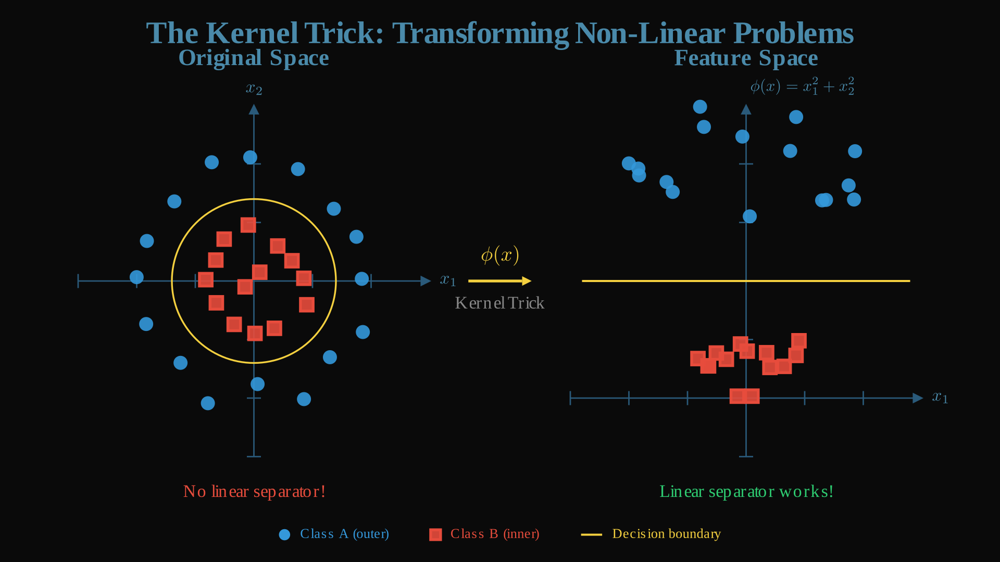

# SmolML - Support Vector Machines: Finding the Optimal Boundary!

Welcome to the **Support Vector Machine (SVM)** section of SmolML! SVMs are one of the most elegant algorithms in supervised machine learning: they find the _optimal_ decision boundary between classes by maximizing the margin. Instead of just finding *any* line or hyperplane that separates the data, SVMs find the *best* one.

I hope you like maths because boy, we're up for a ride.

## Hyperplanes

Imagine you have two groups of points on a 2D plane: red squares and blue circles. A linear classifier draws a line to separate them. But which line is _the best_?

In this case, we the define the _best_ as the maximum margin, so a largest safety zone between classes.

<div align="center">

  
  
</div>

**SVMs** work by finding the line (or **hyperplane** in higher dimensions) that maximizes the distance to the closest points from each class, ensuring we make the best possible split. These closest points are known as **support vectors**: they are the critical data points that "support" the decision boundary. That's why these models are called **Support Vector Machines**!

In an N-dimensional space, a hyperplane has (N − 1) dimensions. That's why in 2D it's simply a line, in 3D it becomes a plane, and so on.


## Math behind SVMs

For now, we will assume we are in a binary classification problem. We need the best hyperplane that can separate both classes. A hyperplane in N dimensions is defined as follows:
$$f(x) = w \cdot x - b = 0$$

- Points where $f(x) > 0$ → class +1
- Points where $f(x) < 0$ → class -1

The distance from the hyperplane to the nearest points (support vectors) is called the **margin**.

Mathematically, for a hyperplane $w \cdot x - b = 0$, the margin width is $\frac{2}{||w||}$. Therefore, to maximize the margin we minimize $||w||^2$ (easier to optimize than $||w||$)

For perfect separation, we want every point correctly classified with margin ≥ 1:
$$y_i(w \cdot x_i - b) \geq 1 \text{ for all } i$$

This is our **primal problem**:
$$\min_{w,b} \frac{1}{2}||w||^2$$
$$\text{subject to: } y_i(w \cdot x_i - b) \geq 1$$

However, most of the time our data has noise and outliers. We usually can't just separate everything with a 100% accuracy. We introduce **slack variables** $\xi_i$ to allow some violations:

$$\min_{w,b,\xi} \frac{1}{2}||w||^2 + C\sum_i \xi_i$$
$$\text{subject to: } y_i(w \cdot x_i - b) \geq 1 - \xi_i, \quad \xi_i \geq 0$$

**Parameter C**: Controls the trade-off
- Large C → penalize violations heavily → tight margin → may overfit
- Small C → allow violations → wider margin → more regularization

**In the code**:
```python
def __init__(self, C=1.0, ...):
    self.C = C  # Regularization parameter
    
# Box constraints enforce 0 ≤ alpha_i ≤ C
if y1 != y2:
    L, H = max(0, a2_old - a1_old), min(self.C, self.C + a2_old - a1_old)
```

<div align="center">

  
  
</div>

We now have a constrained optimization problem. We need to solve:
$$\min_{w,b,\xi} \frac{1}{2}||w||^2 + C\sum_i \xi_i$$
$$\text{subject to: } y_i(w \cdot x_i - b) \geq 1 - \xi_i, \quad \xi_i \geq 0$$

Why can't we just solve this directly? The constraints make it impossible to use simple calculus (setting derivatives to zero). We can't just say "find where $\frac{\partial}{\partial w} = 0$" because we have to ensure all those inequalities hold simultaneously.

Luckily for us, we can use **Lagrange Multipliers**, a classic technique for constrained optimization. The idea is to convert constraints into penalty terms. We create a new function (**the Lagrangian**) that:
- Includes our original objective
- Adds penalty terms for each constraint
- When optimized, naturally satisfies the constraints

At the optimum, either you satisfy the constraint (no penalty) or the constraint doesn't matter (penalty is zero). This converts our constrained problem into an unconstrained one we can solve with calculus!

**The Lagrangian**:
$$L = \frac{1}{2}||w||^2 + C\sum_i \xi_i - \sum_i \alpha_i[y_i(w \cdot x_i - b) - 1 + \xi_i] - \sum_i \mu_i \xi_i$$

Where:
- $\alpha_i \geq 0$ are multipliers for the margin constraints
- $\mu_i \geq 0$ are multipliers for the non-negativity of slack variables

If a constraint is violated, the penalty term becomes large, pushing the solution to satisfy it.

At the optimal solution, the Lagrangian is stationary. Setting derivatives to zero:

1. With respect to $w$:
$$\frac{\partial L}{\partial w} = w - \sum_i \alpha_i y_i x_i = 0$$
$$\implies w = \sum_i \alpha_i y_i x_i$$

The optimal $w$ is a weighted combination of training points! The $\alpha_i$ values are the weights. This means we don't need to store $w$ explicitly, just the $\alpha$ values and the training data.

2. With respect to $b$:
$$\frac{\partial L}{\partial b} = -\sum_i \alpha_i y_i = 0$$
$$\implies \sum_i \alpha_i y_i = 0$$

**This is the equality constraint** maintained in the code:
```python
# When updating two alphas:
s = y1 * y2
a1_new = a1_old + s * (a2_old - a2_new)
# This ensures: a1_new·y1 + a2_new·y2 = a1_old·y1 + a2_old·y2 = constant
```

3. With respect to $\xi_i$:
$$\frac{\partial L}{\partial \xi_i} = C - \alpha_i - \mu_i = 0$$
$$\implies \mu_i = C - \alpha_i$$

Since $\mu_i \geq 0$, we get: $\alpha_i \leq C$

Combined with $\alpha_i \geq 0$: **Box constraint** $0 \leq \alpha_i \leq C$

Substituting these relationships back into the Lagrangian (the algebra is tedious, but the result is beautiful):

$$\max_\alpha \sum_i \alpha_i - \frac{1}{2} \sum_{i,j} \alpha_i \alpha_j y_i y_j (x_i \cdot x_j)$$

Subject to:
- $0 \leq \alpha_i \leq C$
- $\sum_i \alpha_i y_i = 0$

Notice! Only **dot products** $x_i \cdot x_j$ appear! No explicit $w$ or $\xi$. Let me tell you why this is big:

1. **We eliminated variables**: Started with $w$ (could be thousands of dimensions!), $b$, and $\xi_i$ for each point. Now just $\alpha_i$ values.

2. **Only dot products remain**: This is the key that unlocks the kernel trick. Since we only need $x_i \cdot x_j$, we can replace it with ANY function that acts like a dot product, even in infinite dimensions!

3. **Sparse solution incoming**: Most $\alpha_i$ will be zero. Only the "important" points (support vectors) will have $\alpha_i > 0$.

**In the code**:
```python
# We optimize alphas directly, never compute w explicitly
self.alphas = [0.0] * n_samples

# Prediction uses the dual form:
# f(x) = sum(alpha_i * y_i * K(x_i, x)) - b
result = sum(alpha_i * y_i * K(x_i, x) for i in support_vectors) - b
```

## Kernel Trick

Some patterns (circles, spirals, XOR) cannot be separated by a straight line.

<div align="center">

  
  
</div>

The naive solution would be to transform data to higher dimensions where it IS linearly separable:
$$(x_1, x_2) \rightarrow (x_1, x_2, x_1^2, x_2^2, x_1x_2, \sqrt{x_1^2 + x_2^2}, ...)$$

This however, has some obvious problems:
- **Computationally expensive**: Thousands or millions of features
- **Memory intensive**: Must store all transformed data
- **Hard to choose**: Which transformation to use?

The solution to this is using the **kernel trick**.

Our dual problem only needs $x_i \cdot x_j$ (dot products).

The "trick" we can make here is to replace dot products with a **kernel function** $K(x_i, x_j)$ that computes the dot product in a high-dimensional space **without ever going there**!

$$\text{Dual objective: } \sum_i \alpha_i - \frac{1}{2} \sum_{i,j} \alpha_i \alpha_j y_i y_j \, K(x_i, x_j)$$

$$\text{Prediction: } f(x) = \sum_i \alpha_i y_i \, K(x_i, x) - b$$

### Common Kernels

#### Linear Kernel
$$K(x_i, x_j) = x_i \cdot x_j$$

Linear Kernel consists of just using the dot product. It's the simplest but also the fastest. It works well if data is already linearly separable.

#### RBF (Radial Basis Function) Kernel
$$K(x_i, x_j) = \exp(-\gamma ||x_i - x_j||^2)$$

RBF Kernel is the default choice as it is able to handle complex patterns. It implicitly maps to infinite dimensions. It works by measuring similarity based on distance:
- Close points: $K \approx 1$
- Far points: $K \approx 0$

**The γ parameter**:
```python
# Small γ (0.01): Wide influence → smooth boundary
# Large γ (10.0): Local influence → complex boundary

def _compute_gamma(self, X_data, n_features):
    """Compute gamma value based on data."""
    n = len(X_data)
    if n == 0:
        return 1.0
    mean = [sum(X_data[i][j] for i in range(n)) / n for j in range(n_features)]
    var = sum((X_data[i][j] - mean[j]) ** 2 for i in range(n) for j in range(n_features)) / (n * n_features)
    return 1.0 / (n_features * var) if var > 0 else 1.0
```

For RBF kernel, if $\gamma ||x_i - x_j||^2$ is large, $K(x_i, x_j) \approx 0$ (points don't influence each other). If small, $K(x_i, x_j) \approx 1$ (points strongly influence each other).

#### Polynomial Kernel
$$K(x_i, x_j) = (\gamma \cdot x_i \cdot x_j + r)^d$$

Polynomial kernel is used when polynomial relationships are expected.

We compute these kernels in the `_compute_kernel` function of our SVM.
```python
def _compute_kernel(self, x1, x2):
    dot = sum(a * b for a, b in zip(x1, x2))
    
    if self.kernel == "linear":
        return dot  # Original space
    elif self.kernel == "rbf":
        # Dot product in INFINITE-dimensional space!
        sq_dist = sum((a - b) ** 2 for a, b in zip(x1, x2))
        return math.exp(-self._gamma_value * sq_dist)
    elif self.kernel == "poly":
        # Polynomial feature space
        return (self._gamma_value * dot + self.coef0) ** self.degree
```

Notice: We **never transform the data**, we just replace dot products!

## KKT Conditions: How Do We Know We're Optimal?

Okay, we're getting an intuition on how to get to our optimal solution. But how do we actually know when we've found it? And which points should we focus on during optimization?

This is where the **Karush-Kuhn-Tucker (KKT)** conditions come in. They're the mathematical "rules" that every optimal solution must satisfy. 

At the optimal solution, the **Karush-Kuhn-Tucker (KKT)** conditions must hold:

1. **Stationarity**: $\nabla L = 0$ (the derivatives we already computed)
2. **Primal feasibility**: $y_i(w \cdot x_i - b) \geq 1 - \xi_i$, $\xi_i \geq 0$ (constraints are satisfied)
3. **Dual feasibility**: $0 \leq \alpha_i \leq C$, $\mu_i \geq 0$ (Lagrange multipliers are non-negative)
4. **Complementary slackness**: $\alpha_i[y_i(w \cdot x_i - b) - 1 + \xi_i] = 0$ (either the constraint is tight or the multiplier is zero)

**What does "complementary slackness" mean?** For each point, either:
- The margin constraint is exactly satisfied ($y_i f(x_i) = 1$), OR
- The corresponding $\alpha_i = 0$

They can't both be "active" at the same time. Either a point is sitting on the margin, or it does not matter.

What does this mean in practice exactly? For each training point, exactly one of these holds:

```python
if alpha_i == 0:
    # Point is correctly classified, well outside margin
    # Doesn't affect the decision boundary at all
    # Condition: y_i * f(x_i) >= 1
    # "I'm far from the action, I don't matter"
    
elif 0 < alpha_i < C:
    # Point is ON the margin (support vector on margin)
    # Critical for defining boundary
    # Condition: y_i * f(x_i) = 1  (exactly!)
    # These are "free" support vectors
    # "I'm right on the edge, perfectly positioned"
    
elif alpha_i == C:
    # Point violates margin (inside margin or misclassified)
    # May be an outlier or noise
    # Condition: y_i * f(x_i) <= 1
    # These are "bounded" support vectors
    # "I'm problematic—either misclassified or too close"
```

After training, typically 80-95% of points have $\alpha_i = 0$. They're completely irrelevant! Only the 5-20% that are support vectors matter.

## SMO Algorithm

We know what we're optimizing (the dual problem) and we know when we're done (KKT conditions). But we still need a method to actually find the optimal $\alpha$ values. How do we train the SVM?

### Standard Approach: Quadratic Programming

**Typical QP solver**:
1. Build full kernel matrix: $K_{ij} = K(x_i, x_j)$ for all pairs
   - **Size**: N × N matrix
   - **For 10,000 samples**: 100 million entries ≈ 800 MB in memory
2. Solve using interior point methods or active set methods
   - **Complexity**: $O(N^3)$ worst case
   - **Memory**: Must hold entire kernel matrix in RAM

This clearly has too many problems. Also, we are implementing this in Python, so in no way this is not going to blow up. The kernel matrix would be too large for big datasets, that complexity is prohibitibe and also it's kind of hard to understand what's happening inside the solver. This is why we use another strategy: **SMO**.

### SMO: Sequential Minimal Optimization

The constraint $\sum_i \alpha_i y_i = 0$ couples all variables together. But we can optimize just **two** alphas at a time while maintaining this constraint analytically!

Why Two Variables?

**Can't optimize one**: If we change $\alpha_1$ alone, we violate $\sum_i \alpha_i y_i = 0$

**Two variables work perfectly**: With $\alpha_1$ and $\alpha_2$:
$$\alpha_1 y_1 + \alpha_2 y_2 = -\sum_{i \neq 1,2} \alpha_i y_i = \text{constant}$$

This is a **straight line constraint** in the $(\alpha_1, \alpha_2)$ plane that we can solve in closed form!

```python
# Maintain the constraint:
s = y1 * y2
a1_new = a1_old + s * (a2_old - a2_new)
# This ensures: a1_new·y1 + a2_new·y2 = a1_old·y1 + a2_old·y2
```

SMO uses KKT violations to decide which points need optimization. If a point violates its KKT conditions, adjusting its $\alpha$ could improve the solution.

SMO checks for violations to find which alphas need updating:
```python
def _examine_example(self, i2, X_data, y_data, errors):
    E2 = errors[i2]  # Prediction error: f(x_i) - y_i
    y2 = y_data[i2]
    r2 = E2 * y2      # Signed error
    
    # Check for KKT violation:
    # If r2 < -tol and alpha < C: point wants to increase alpha
    # If r2 > tol and alpha > 0: point wants to decrease alpha
    if not ((r2 < -self.tol and self.alphas[i2] < self.C) or 
            (r2 > self.tol and self.alphas[i2] > 0)):
        return 0  # KKT satisfied, skip this point
    
    # KKT violated → optimize this alpha with a partner
    # ... find partner and update ...
```

**Why this check works**: The quantity $r_2 = E_2 \cdot y_2$ tells us if the point violates KKT:
- If $r_2 < -\text{tol}$: prediction is too far on the wrong side, need larger $\alpha$
- If $r_2 > \text{tol}$: prediction is too far on the right side, need smaller $\alpha$
- If $|r_2| \leq \text{tol}$: KKT satisfied, leave it alone

If a point violates KKT, it means adjusting its $\alpha$ could improve the objective function. These are the points that need optimization.

### SMO Benefits vs. Standard QP

| Aspect | Standard QP | SMO |
|--------|-------------|-----|
| Memory | $O(N^2)$ - kernel matrix | $O(N)$ - alphas only |
| Speed per iteration | Solve full system | Closed form (2 variables) |
| Total iterations | Fewer | More |
| Overall speed | Slow for large N | Fast even for large N |
| Transparency | Black box | Clear what's happening |

**Trade-off**: More iterations (2 variables at a time vs all N), but each iteration is **much** faster.

The following is the SMO main loop:

```python
# Initialize
self.alphas = [0.0] * n_samples
errors = [f(x_i) - y_i for i in range(n_samples)]

examine_all = True  # Start by examining all points
num_changed = 0

while (num_changed > 0 or examine_all) and iteration < max_iter:
    num_changed = 0
    
    if examine_all:
        # Phase 1: Check all points
        indices = range(n_samples)
    else:
        # Phase 2: Only check non-bound support vectors (0 < alpha < C)
        indices = [i for i in range(n_samples) if 0 < self.alphas[i] < self.C]
    
    for i2 in indices:
        num_changed += self._examine_example(i2, X_data, y_data, errors)
    
    # Alternate between checking all vs. non-bound points
    examine_all = not examine_all if num_changed == 0 or examine_all else False
    iteration += 1
```

1. **Initially**: Examine **all** points to find initial support vectors
2. **Find violations**: Identify points violating KKT conditions
3. **Efficiency**: After a full pass, only examine **non-bound** points (0 < α < C)
4. **Convergence**: Alternate until no changes occur

Why do we alternate, though? Non-bound points are most likely to need updates (they're on the margin). Checking only them speeds up convergence. But we occasionally check all points to ensure we haven't missed anything.

Once we've selected $i_2$ (a point violating KKT), how do we choose $i_1$ to pair with it?

Different pairs lead to different amounts of progress. A good heuristic can converge in hundreds of iterations instead of thousands!

### Heuristic 1: Maximize $|E_1 - E_2|$ (Error Difference)

```python
def _select_partner(self, i2, E2, errors):
    """Select partner that maximizes |E1 - E2|."""
    best_i, max_delta = -1, 0
    for i, alpha in enumerate(self.alphas):
        if 0 < alpha < self.C:  # Only check non-bound points
            delta = abs(errors[i] - E2)
            if delta > max_delta:
                max_delta, best_i = delta, i
    return best_i
```

This works because maximizing $|E_1 - E_2|$ often leads to the largest improvement in the objective function. If one point has a large positive error and another has a large negative error, adjusting both simultaneously makes a big difference.

### Heuristic 2: Random Non-Bound Points

If heuristic 1 fails or finds no partner:

```python
non_bound = [i for i in range(len(X_data)) if 0 < self.alphas[i] < self.C and i != i2]
random.shuffle(non_bound)
for i1 in non_bound:
    if self._take_step(i1, i2, X_data, y_data, errors):
        return 1  # Success!
```

### Heuristic 3: All Points

If heuristics 1 and 2 fail, try all points:

```python
all_indices = [i for i in range(len(X_data)) if i != i2]
random.shuffle(all_indices)
for i1 in all_indices:
    if self._take_step(i1, i2, X_data, y_data, errors):
        return 1
```

## Optimizing the Pair (`_take_step`)

This is where the magic happens. We optimize $\alpha_1$ and $\alpha_2$ while holding all others fixed.

### Step 1: Compute Bounds L and H

From the constraint $\alpha_1 y_1 + \alpha_2 y_2 = \gamma$ (constant) and box constraints $0 \leq \alpha \leq C$:

```python
s = y1 * y2  # s is either +1 or -1

if y1 != y2:  # Different labels (s = -1)
    # Constraint: alpha1 - alpha2 = constant
    L = max(0, a2_old - a1_old)
    H = min(self.C, self.C + a2_old - a1_old)
else:  # Same labels (s = +1)
    # Constraint: alpha1 + alpha2 = constant
    L = max(0, a2_old + a1_old - self.C)
    H = min(self.C, a2_old + a1_old)

if L >= H:
    return False  # No feasible region
```

Geometrically, the constraint $\alpha_1 y_1 + \alpha_2 y_2 = \gamma$ defines a line in the $(\alpha_1, \alpha_2)$ space. This line must intersect the box $[0, C] \times [0, C]$. The intersection gives us the valid range $[L, H]$ for $\alpha_2$.

### Step 2: Compute New $\alpha_2$

The objective function is quadratic in $\alpha_2$ along the constraint line. We use the second derivative (curvature) to find the optimum:

```python
k11 = self._compute_kernel(X_data[i1], X_data[i1])
k12 = self._compute_kernel(X_data[i1], X_data[i2])
k22 = self._compute_kernel(X_data[i2], X_data[i2])

eta = k11 + k22 - 2 * k12  # Second derivative (curvature)

if eta > 0:
    # Standard case: use Newton's method
    a2_new = a2_old + y2 * (E1 - E2) / eta
    
    # Clip to feasible bounds
    a2_new = max(L, min(H, a2_new))
else:
    # Unusual case: eta <= 0
    # This happens with identical points or numerical issues
    # Evaluate objective at bounds L and H, choose the better one
    
    f1 = y1 * (E1 + self.b) - a1_old * k11 - s * a2_old * k12
    f2 = y2 * (E2 + self.b) - s * a1_old * k12 - a2_old * k22
    
    L1 = a1_old + s * (a2_old - L)
    H1 = a1_old + s * (a2_old - H)
    
    Lobj = L1 * f1 + L * f2 + 0.5 * L1**2 * k11 + 0.5 * L**2 * k22 + s * L * L1 * k12
    Hobj = H1 * f1 + H * f2 + 0.5 * H1**2 * k11 + 0.5 * H**2 * k22 + s * H * H1 * k12
    
    if Lobj < Hobj - 1e-8:
        a2_new = L
    elif Hobj < Lobj - 1e-8:
        a2_new = H
    else:
        a2_new = a2_old  # No clear winner, don't change
```

`eta` is the second derivative of the objective function with respect to $\alpha_2$. 

**Why eta can be ≤ 0**: 
- If $x_1 = x_2$, then $\eta = 0$
- Floating-point errors in kernel computation
- Some non-standard kernels can produce negative values (rare)

When `eta ≤ 0`, we can't use the closed-form solution. Instead, we evaluate the objective at both boundary points (L and H) and pick whichever is better.

**Check if change is significant**:
```python
if abs(a2_new - a2_old) < 1e-8 * (a2_new + a2_old + 1e-8):
    return False  # Change too small, not worth updating
```

### Step 3: Update $\alpha_1$

From the constraint $\alpha_1 y_1 + \alpha_2 y_2 = \text{constant}$:

```python
s = y1 * y2
a1_new = a1_old + s * (a2_old - a2_new)
```

**Verification**: 
- Before: $a1_{old} \cdot y_1 + a2_{old} \cdot y_2 = \gamma$
- After: $a1_{new} \cdot y_1 + a2_{new} \cdot y_2 = (a1_{old} + s(a2_{old} - a2_{new})) \cdot y_1 + a2_{new} \cdot y_2$
- Simplify: $= a1_{old} \cdot y_1 + a2_{old} \cdot y_1 \cdot y_2 - a2_{new} \cdot y_1 \cdot y_2 + a2_{new} \cdot y_2$
- Since $y_1 \cdot y_2 = s$ and $y_i^2 = 1$: $= a1_{old} \cdot y_1 + a2_{old} \cdot y_2 = \gamma$ ✓

### Step 4: Update Bias $b$

Support vectors on the margin ($0 < \alpha < C$) must satisfy $y_i f(x_i) = 1$ exactly. We use this to compute the bias:

```python
# What should b be to make y1 * f(x1) = 1?
b1 = E1 + y1 * (a1_new - a1_old) * k11 + y2 * (a2_new - a2_old) * k12 + self.b

# What should b be to make y2 * f(x2) = 1?
b2 = E2 + y1 * (a1_new - a1_old) * k12 + y2 * (a2_new - a2_old) * k22 + self.b

# Choose based on which alphas are on the margin
if 0 < a1_new < self.C:
    self.b = b1  # Point 1 is on margin, use its constraint
elif 0 < a2_new < self.C:
    self.b = b2  # Point 2 is on margin, use its constraint
else:
    self.b = (b1 + b2) / 2  # Both at bounds, average the estimates
```

**Why this works**: 
- If $0 < \alpha_i < C$, then by KKT conditions, $y_i f(x_i) = 1$ (exactly on margin)
- We solve for $b$ that satisfies this constraint
- If both points are at bounds (α = 0 or α = C), we average both estimates

### Step 5: Update All Errors

Since we changed $\alpha_1$ and $\alpha_2$ (and possibly $b$), all predictions have changed:

```python
for i in range(len(X_data)):
    errors[i] = self._decision_function_single(X_data[i]) - y_data[i]
```

We could incrementally update errors based on the changes to $\alpha_1$, $\alpha_2$, and $b$, which would be faster. But recomputing from scratch is simpler and more robust to numerical errors.

The complete `_take_step` flow is something like this:

```
1. Check if i1 == i2 → return False
2. Compute bounds L, H from constraint + box constraints
3. If L >= H → return False (no feasible region)
4. Compute eta (second derivative)
5. If eta > 0: 
     Use closed-form solution
   Else:
     Evaluate objective at bounds
6. Check if change is significant → return False if too small
7. Update alpha1 using constraint
8. Update bias b using margin constraints
9. Store new alphas
10. Update all errors
11. return True (success!)
```

---

## Making Predictions

Once trained, we have optimal $\alpha$ values. The decision function is:

$$f(x) = \sum_i \alpha_i y_i K(x_i, x) - b$$

Only support vectors ($\alpha_i > 0$) contribute! For example, if we have 1000 points, but only 10 of those are support vectors, then only have to perform 10 iterations and can safely ignore the rest.

```python
def _decision_function_single(self, x):
    """Compute f(x) = sum(alpha_i * y_i * K(x_i, x)) - b"""
    result = -self.b
    for i, alpha in enumerate(self.alphas):
        if alpha > 1e-8:  # Support vectors only!
            result += alpha * self.y_train[i] * self._compute_kernel(self.X_train[i], x)
    return result
```

Due to numerical precision, alphas that should be zero might be tiny values like `1e-15`. We use the `ie-8` threshold to treat these as zero.

## Binary Classification

And that's it! After this tremendous math journey, we finally have our SVM classifier:

```python
def predict(self, X):
    """Predict class labels."""
    X_data = X.to_list()
    if not isinstance(X_data[0], list):
        X_data = [X_data]
    
    # Sign of decision function determines class
    return MLArray([
        self._label_map_inverse[1 if self._decision_function_single(x) >= 0 else -1] 
        for x in X_data
    ])
```

- $f(x) > 0$ → Positive class
- $f(x) < 0$ → Negative class  
- $f(x) = 0$ → On the decision boundary (could go either way)

Now, we've covered binary classification, but what about multiple classes? Or regression instead of classification? Let's see how we can extend SVMs to these scenarios!

## Multiclass Classification

SVMs are inherently binary classifiers (two classes only). For being able to classify K classes, we use the **One-vs-Rest (OvR)** strategy.

### One-vs-Rest Strategy

Train K binary classifiers:
- Classifier 1: Class 0 vs. (Class 1, 2, ..., K-1)
- Classifier 2: Class 1 vs. (Class 0, 2, ..., K-1)
- ...
- Classifier K: Class K-1 vs. (Class 0, 1, ..., K-2)

```python
class SVMMulticlass:
    def fit(self, X, y):
        """Train one SVM per class using One-vs-Rest."""
        y_data = y.to_list()
        self.classes = sorted(set(y_data))
        
        # Train K binary classifiers
        for cls in self.classes:
            # Create binary labels: 1 for current class, 0 for all others
            y_binary = [1 if label == cls else 0 for label in y_data]
            
            # Train binary SVM
            svm = SVM(C=self.C, kernel=self.kernel, gamma=self.gamma, ...)
            svm.fit(X, MLArray(y_binary))
            
            self.classifiers[cls] = svm
        
        return self
```

### Prediction

For a new point, we run all K classifiers and choose the class with highest decision value:

```python
def predict(self, X):
    """Predict class with highest decision function value."""
    X_data = X.to_list()
    if not isinstance(X_data[0], list):
        X_data = [X_data]
    
    predictions = []
    for x in X_data:
        # Get decision value from each classifier
        scores = {cls: svm._decision_function_single(x) 
                 for cls, svm in self.classifiers.items()}
        
        # Choose class with highest confidence
        prediction = max(scores, key=scores.get)
        predictions.append(prediction)
    
    return MLArray(predictions)
```

The decision function $f(x)$ represents confidence. Larger values mean the point is further from the boundary, indicating higher confidence.

Great! Following this strategy we can solve classification problems. However, what if we want to use this model for regression? Is it possible?

## Support Vector Regression (SVR)

SVMs aren't just for classification! **Support Vector Regression (SVR)** applies the same elegant ideas to continuous prediction.

### The ε-Insensitive Tube

In classification, we maximize the margin between classes. In regression, we fit a **tube** around the data.

<div align="center">

  
  
</div>

### ε-Insensitive Loss

$$L(y, f(x)) = \max(0, |y - f(x)| - \epsilon)$$

**Interpretation**:
- If $|y - f(x)| \leq \epsilon$: Loss = 0 (inside tube, no penalty)
- If $|y - f(x)| > \epsilon$: Loss = $|y - f(x)| - \epsilon$ (outside tube, penalized)

This creates a "tube of tolerance" around predictions.

### Two Sets of Multipliers

For SVR, we need **two** Lagrange multipliers per sample:
- $\alpha_i$: for points **above** the tube where $y_i - f(x_i) > \epsilon$ (prediction too low)
- $\alpha_i^*$: for points **below** the tube where $f(x_i) - y_i > \epsilon$ (prediction too high)

**Key constraint**: For each point, at most one of $\alpha_i$ or $\alpha_i^*$ can be non-zero (can't be both above and below the tube simultaneously).

### Prediction Function

$$f(x) = \sum_i (\alpha_i - \alpha_i^*) K(x_i, x) + b$$

**In the code**:
```python
def _predict_single(self, x):
    """Compute f(x) = sum((alpha_i - alpha_i*) * K(x_i, x)) + b"""
    result = self.b  # Note: +b for regression, -b for classification
    for i in range(len(self.X_train)):
        coef = self.alphas[i] - self.alphas_star[i]
        if abs(coef) > 1e-8:
            result += coef * self._compute_kernel(self.X_train[i], x)
    return result
```

Only samples **outside the ε-tube** have non-zero $\alpha$ or $\alpha^*$ — these are the **support vectors** for regression.

### The C and Epsilon Trade-off

SVR has **two** key parameters:

**C (Regularization)**:
- Large C → Penalize violations heavily → Fit data closely → Risk overfitting
- Small C → Allow more violations → Smoother function → More regularization

**ε (Tube width)**:
- Small ε → Tight tube → More support vectors → Better fit
- Large ε → Wide tube → Fewer support vectors → Smoother, more regularized

### SVR Example

```python
from smolml.models.svm import SVR
from smolml.core.ml_array import MLArray

# Regression data
X = [[1], [2], [3], [4], [5], [6], [7], [8]]
y = [1.5, 2.8, 3.2, 4.1, 5.5, 6.2, 6.9, 8.1]

# Train SVR with RBF kernel
svr = SVR(kernel="rbf", C=10.0, epsilon=0.5, gamma="scale")
svr.fit(X, y)

print(svr)  # Shows model info and support vectors

# Predict
predictions = svr.predict([[2.5], [5.5], [9]])
print(f"Predictions: {predictions.to_list()}")

# R² score (coefficient of determination)
r2 = svr.score(X, y)
print(f"R² Score: {r2:.4f}")

# Mean Squared Error
mse = svr.mse(X, y)
print(f"MSE: {mse:.4f}")
```

And that's it! This has been a pretty math-heavy journey, but now our SVM and SVR models are finished! In the next section however, we will jump into unsupervised learning with models that do not require learning.

[Next Section: K-Means](https://github.com/rodmarkun/SmolML/tree/main/smolml/models/unsupervised)

## Resources

- [**Original SVM paper**: Cortes & Vapnik (1995) - "Support-Vector Networks"](https://link.springer.com/article/10.1007/BF00994018)
- [Support Vector Machines (SVM): An Intuitive Explanation](https://medium.com/low-code-for-advanced-data-science/support-vector-machines-svm-an-intuitive-explanation-b084d6238106)