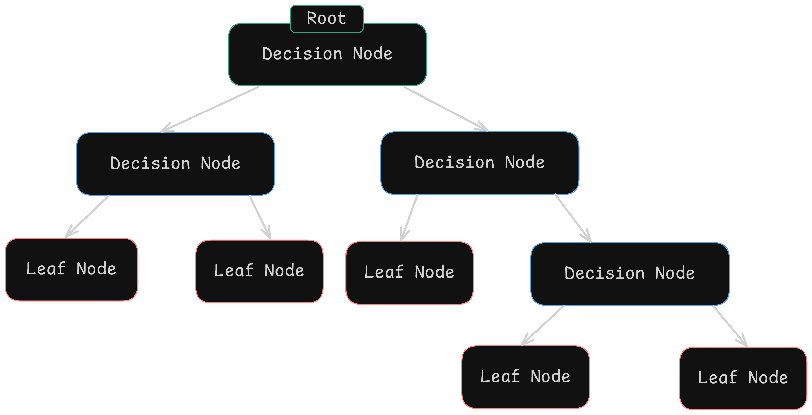
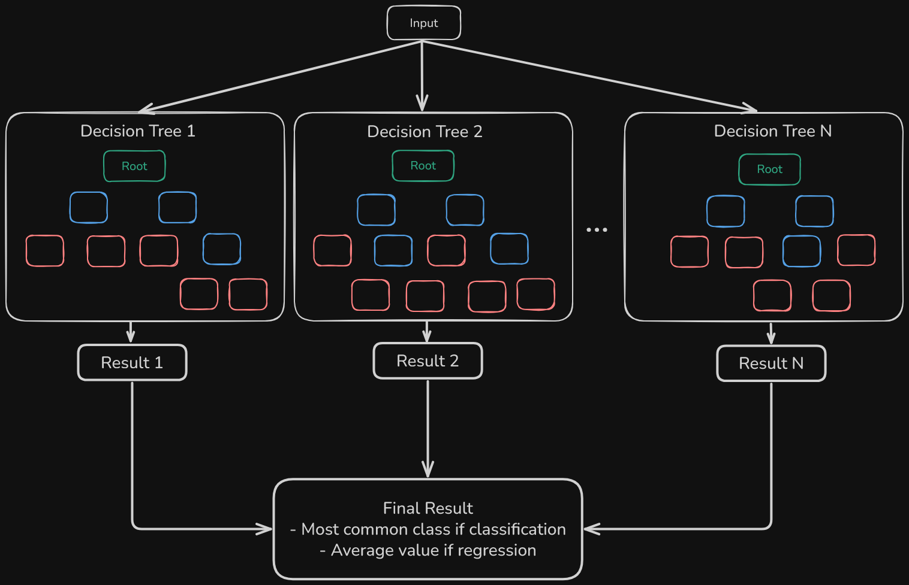

# SmolML - Tree Models: Decisions, Decisions!

Welcome to the _branch_ of SmolML dealing with **Tree-Based Models**! Unlike the models we saw in `Regression` (which rely on smooth equations and gradient descent), Decision Trees and their powerful sibling, Random Forests, make predictions by learning a series of explicit **decision rules** from the data. Think of it like building a sophisticated flowchart to classify an email as spam or not spam, or to predict a house price.

Instead of finding a smooth mathematical function that fits the data, trees ask a series of yes/no questions. "_Is the email subject line longer than 50 characters?_" → "_Does it contain the word 'FREE'?_" → "_Was it sent after midnight?_" Each answer narrows down the prediction until we reach a final decision. This makes them incredibly interpretable as you can literally trace the path the model took to make a prediction!

These models are incredibly versatile, handling both **classification** (predicting categories) and **regression** (predicting numerical values) tasks. They **don't need feature scaling** and can capture complex, non-linear relationships. Let's dive into how they work!

## Decision Trees

Imagine you're trying to decide if you should play tennis today. You might ask:
1.  Is the outlook sunny?
    * Yes -> Is it scorching hot?
        * Yes -> Don't Play
        * No -> Play!
    * No -> Is it raining?
        * Yes -> Don't Play
        * No -> Play!

That's the essence of a **Decision Tree**! It's a structure that recursively splits the data based on simple questions about the input features. But how do we actually _train_ something like this?

We could model each of these decisions as a `DecisionNode`. Imagine it! We take today's data. Based on that data we choose **a feature to split on**. For example, in the first decision we check the outlook of the day, while in the next one we might check temperature or a boolean indicating rain.

Of course, we need some **threshold** to split our decisions. For example, more than 35°C might be too hot to play tennis (or 25°C if you're British). But that threshold is what determines whether we play or not.

Each decision might lead to other decisions, so we should store the **possible decisions** down our tree. Basically, other `DecisionNode`s that derive from the current one.

And finally, we need some **value** for the final (leaf) decisions. In this case, we might assume that if we play, the value is `1`, and if we don't, it's `0`.

We can implement a simple class based on this!

```python
class DecisionNode:
    """
    Node in decision tree that handles splitting logic.
    Can be either internal node (with split rule) or leaf (with prediction).
    """
    def __init__(self, feature_idx=None, threshold=None, left=None, right=None, value=None):
        self.feature_idx = feature_idx  # Index of feature to split on
        self.threshold = threshold      # Value to split feature on
        self.left = left               # Left subtree (feature <= threshold)
        self.right = right             # Right subtree (feature > threshold)
        self.value = value             # Prediction value (for leaf nodes)

    def __repr__(self):
        if self.value is not None:
            return f"Leaf(value={self.value})"
        return f"Node(feature={self.feature_idx}, threshold={self.threshold:.4f})"
```

<div align="center">
  
</div>

Great! Now we have an object to represent our decisions. But we're missing the most important part: using this as part of a `DecisionTree`. The goal is for the model to automatically learn which feature and threshold to split on from a dataset, eventually reaching leaf nodes with prediction values.

Okay, let's think this through: we need a structure to hold these `DecisionNode`s. These are actually continuously generated during training, so... maybe we should have some kind of limit?

We must ask ourselves: how _big_ do we want our tree to be? Or better yet, how **deep**? That's the main parameter our tree is going to have! A `max_depth` parameter will control how many levels of decisions we allow. A deeper tree can capture more complex patterns but risks overfitting to the training data.

Of course, we need an starting `DecisionNode` that will serve as our **root**, from which all other `DecisionNode`s will be children. But we can save that for later, whenever we start actually training our model.

But depth isn't the only consideration! We also need **stopping criteria** to prevent the tree from making splits that don't help much:
- What's the **minimum number of samples** a node must have before we even consider splitting it? If a node only has a handful of data points, splitting might not be meaningful.
- How many **samples should each leaf node contain at minimum**? This ensures our predictions are based on a reasonable amount of data rather than just one or two examples. It's another guard against overfitting, we don't want leaves that memorize individual training examples!

Finally, for implementation purposes, we should know the **task** for which the `DecisionTree` is to be used (_regression_ or _classification_). This determines how we make predictions at leaf nodes: for classification, we typically use the most common class, while for regression, we use the average value of samples in that leaf.

We end up with a constructor like this:

```python
class DecisionTree:
    """
    Decision Tree implementation supporting both classification and regression.
    Uses binary splitting based on feature thresholds.
    """
    def __init__(self, max_depth=None, min_samples_split=2, min_samples_leaf=1, task="classification"):
        """
        Initialize decision tree with stopping criteria.
        
        max_depth: Maximum tree depth to prevent overfitting
        min_samples_split: Minimum samples required to split node
        min_samples_leaf: Minimum samples required in leaf nodes
        task: "classification" or "regression"
        """
        self.max_depth = max_depth
        self.min_samples_split = min_samples_split
        self.min_samples_leaf = min_samples_leaf
        self.task = task
        self.root = None
```

Fine, time to train this thing! We are going to implement quite a lot of methods for this to work cleanly. The main logic will go into the main recursive method, `_grow_tree`:

When dealing with recursivity, we should first define when is our algorithm going to end:
- **We reach max depth**: If we've gone as deep as we specified in `max_depth`, we stop. This prevents the tree from becoming too complex and overfitting to the training data.
- **Too few samples to split**: If the current node has fewer samples than `min_samples_split`, we can't meaningfully split it further. Imagine trying to make a decision based on just one data point, that's just not good.
- **Too few samples for a leaf**: _Even_ if we split, if either resulting child would have fewer than `min_samples_leaf` samples, we don't bother. This ensures our predictions are based on enough data.
- **Pure node**: If all samples in the current node have the same label (for classification) or value (for regression), there's no point in splitting further, we've literally splitted it perfectly!

When any of these conditions are true, we create a leaf node with a prediction value. For classification, this is the most common class among the samples in that node. For regression, it's the average value. We included this logic in the `_leaf_value` method:

```python
def _leaf_value(self, y):
    """
    Determines prediction value for leaf node:
    - Most common class for classification
    - Mean value for regression
    """
    if self.task == "classification":
        return max(set(y), key=y.count)
    return sum(y)/len(y)
```

Now, if none of these criteria are met, we need to actually split the data. First we need a method `_split_data` that, given a `feature_idx` and a `threshold`, will split the data into its "left" and "right". This one's easy: 

```python
def _split_data(self, X, feature_idx, threshold):
    """
    Splits data based on feature and threshold.
    """
    left_idxs = []
    right_idxs = []
    
    for i, row in enumerate(X):
        if row[feature_idx] <= threshold:
            left_idxs.append(i)
        else:
            right_idxs.append(i)
            
    return left_idxs, right_idxs
```

We should define a method `_find_best_split` that will tell us which is the best **feature** and **threshold** to use. This method should loop over each **feature** and each **threshold** over our data, constantly making splits and trying to find the best ones. _But wait!_ How do we know how **good** a pair of feature and threshold are? We will do so with a concept named **information gain**, which we will calculate in `_calculate_gain`.

```python
def _find_best_split(self, X, y):
    """
    Finds best feature and threshold for splitting data.
    Uses information gain for classification, MSE for regression.
    """
    best_gain = -float('inf')
    best_feature = None
    best_threshold = None

    n_features = len(X[0])
    
    for feature_idx in range(n_features):
        thresholds = sorted(set(row[feature_idx] for row in X))
        
        for threshold in thresholds:
            left_idxs, right_idxs = self._split_data(X, feature_idx, threshold)
            
            if len(left_idxs) < self.min_samples_leaf or len(right_idxs) < self.min_samples_leaf:
                continue

            left_y = [y[i] for i in left_idxs]
            right_y = [y[i] for i in right_idxs]
            
            gain = self._calculate_gain(y, left_y, right_y)
            
            if gain > best_gain:
                best_gain = gain
                best_feature = feature_idx
                best_threshold = threshold

    return best_feature, best_threshold
```

**Gain** (also called **Information Gain**) is a metric used to determine which feature should be used to split the data at each node when building a decision tree. It measures how much a particular split reduces uncertainty or _impurity_ in the dataset. Think of it this way: a good split is one that creates child nodes that are more 'pure' than the parent. If we can separate 'Yes' samples from 'No' samples effectively, we've gained information!

Gain is calculated as the difference between the impurity of the parent node and the weighted average impurity of the child nodes after splitting:

_Gain = Impurity(parent) - Weighted Average of Impurity(children)_

The impurity is commonly measured using **entropy** (for classification) or **variance** (for regression).

- For **classification**: If all samples in a node belong to the same class, entropy is 0 (no uncertainty). If samples are distributed across classes, entropy is maximized. The formula for entropy is:

$$
H(S) = -Σ(p_i × log₂(p_i))
$$

    Where $p_i$ is the proportion of samples belonging to class $i$

```python
def _information_gain_entropy(self, parent, left, right):
    """
    Calculates information gain using entropy.
    """
    def entropy(y):
        counts = Counter(y)
        probs = [count/len(y) for count in counts.values()]
        return -sum(p * math.log2(p) for p in probs)

    n = len(parent)
    entropy_parent = entropy(parent)
    entropy_children = (len(left)/n * entropy(left) + 
                        len(right)/n * entropy(right))
    return entropy_parent - entropy_children
```

Example: If the parent has 50% Yes and 50% No (high entropy), and after splitting you get left child with 90% Yes and right child with 90% No (both low entropy), you've gained a lot of information.

- For **regression**: We will use the _Mean Squared Error_ to measure how spread out the target values are before splitting. The MSE calculates the average squared distance from the mean. If MSE is high, values are scattered. If MSE is low, values are clustered together.

```python
def _information_gain_mse(self, parent, left, right):
    """
    Calculates reduction in MSE.
    """
    def mse(y):
        mean = sum(y)/len(y)
        return sum((val - mean)**2 for val in y)/len(y)

    n = len(parent)
    mse_parent = mse(parent)
    mse_children = (len(left)/n * mse(left) + 
                len(right)/n * mse(right))
    return mse_parent - mse_children
```

If a parent node has values [100, 110, 200, 210] (scattered, high MSE), and splitting gives us [100, 110] and [200, 210] (clustered, low MSE in each), we've successfully reduced variance!

And we will wrap it into a method `_calculate_gain` that routes to the correct function depending on the current task (that's why we stored it when creating the tree!):

```python
def _calculate_gain(self, parent, left, right):
    """
    Calculates gain from split:
    - Information gain for classification
    - Reduction in MSE for regression
    """
    if self.task == "classification":
        return self._information_gain_entropy(parent, left, right)
    return self._information_gain_mse(parent, left, right)
```

Nice! We now have everything we need to create a tree from some data `X` associated with labels `y` up to a certain `depth`. Taking into account the stopping criteria we defined earlier and the functions we just saw, can you implement this main `_grow_tree` method? :)

Here's our implementation:

```python
def _grow_tree(self, X, y, depth=0):
    """
    Recursively grows tree by finding best splits.
    """
    n_samples = len(X)
    
    # Check stopping criteria
    if (self.max_depth is not None and depth >= self.max_depth or 
        n_samples < self.min_samples_split or 
        self._is_pure(y)):
        return DecisionNode(value=self._leaf_value(y))

    # Find best split
    best_feature, best_threshold = self._find_best_split(X, y)
    
    if best_feature is None:  # No valid split found
        return DecisionNode(value=self._leaf_value(y))

    # Split data
    left_idxs, right_idxs = self._split_data(X, best_feature, best_threshold)
    
    # Check min_samples_leaf
    if len(left_idxs) < self.min_samples_leaf or len(right_idxs) < self.min_samples_leaf:
        return DecisionNode(value=self._leaf_value(y))

    # Create child nodes
    left_X = [X[i] for i in left_idxs]
    right_X = [X[i] for i in right_idxs]
    left_y = [y[i] for i in left_idxs]
    right_y = [y[i] for i in right_idxs]

    left = self._grow_tree(left_X, left_y, depth + 1)
    right = self._grow_tree(right_X, right_y, depth + 1)

    return DecisionNode(feature_idx=best_feature, threshold=best_threshold, left=left, right=right)
```

Notice how `_grow_tree` calls itself with `left = self._grow_tree(...)` and `right = self._grow_tree(...)`? Each call builds its own subtree, and when they return, we connect them to the current node. The `depth + 1` parameter ensures each level knows how deep it is with respect to the root.

Nice! Now we got the main method for building our tree, let's wrap it nicely into a `fit` method:

```python
def fit(self, X, y):
    """
    Build decision tree by recursively splitting data.
    """
    if not isinstance(X, MLArray):
        X = MLArray(X)
    if not isinstance(y, MLArray):
        y = MLArray(y)
        
    self.n_classes = len(set(y.flatten(y.data))) if self.task == "classification" else None
    self.root = self._grow_tree(X.data, y.data)
```

Once the tree is built, predicting is straightforward! For a new data point:
1. We start at the `root` node
2.  Check the decision rule (feature and threshold) at the current node.
3.  Follow the corresponding branch (left if `feature_value <= threshold`, right otherwise).
4.  Repeat steps 2 and 3 until you reach a leaf node (`_traverse_tree` method).
5.  The prediction is the value stored in that leaf node (`node.value`).

```python
def predict(self, X):
    """
    Makes predictions using trained tree.
    """
    if not isinstance(X, MLArray):
        X = MLArray(X)
        
    return MLArray([self._traverse_tree(x, self.root) for x in X.data])

def _traverse_tree(self, x, node):
    """
    Traverses tree to make prediction for single sample.
    """
    if node.value is not None:  # Leaf node
        return node.value

    if x[node.feature_idx] <= node.threshold:
        return self._traverse_tree(x, node.left)
    return self._traverse_tree(x, node.right)
```

In these trees prediction is super fast, `O(log n)` in balanced trees, because we only follow one path from root to leaf, and we don't need to examine the rest of the nodes.

This is also where decision trees really shine for interpretability. You can literally print out the path taken: 
'Temperature > 25°C → Humidity ≤ 60% → Play Tennis!'. We added a small `show_tree` method for easy visualization after training:

```
Decision Tree Structure:
Root: sepal length (cm) <= 5.7000
├─ Left: sepal width (cm) <= 3.1000
│  ├─ Left: sepal length (cm) <= 5.2000
│  │  ├─ Left: sepal width (cm) <= 2.7000
│  │  │  ├─ Left: sepal length (cm) <= 4.9000
│  │  │  │  ├─ Left: Leaf → Class 0.0
│  │  │  │  └─ Right: Leaf → Class 1.0
│  │  │  └─ Right: sepal length (cm) <= 4.4000
│  │  │     ├─ Left: Leaf → Class 0.0
│  │  │     └─ Right: Leaf → Class 0.0
...
```

Cool, right? A single tree is intuitive, but sometimes they can be a bit unstable and prone to overfitting. What if we could combine _many_ trees?

### Run tests!

Feel free to run `tests/decision_tree_tests.py` to see how our new model can be used for both classification and regression using real [Sklearn](https://scikit-learn.org) datasets! 

The test will generate some plots with the results. Change the parameters of the test as you will, or try it with other datasets and against other frameworks!

## Random Forests

A single Decision Tree can be sensitive to the specific data it's trained on. A slightly different dataset might produce a very different tree structure. **Random Forests** tackle this by building an _ensemble_ (a "forest") of many Decision Trees trained differently and combining their predictions. It's like asking many different experts (trees) and going with the consensus!

<div align="center">
  
</div>

Random Forests use two clever techniques to create diverse trees that, when combined, make better predictions than a single tree:

The first one is **bootstrap aggregating** (_bagging_). Each tree is trained on a different **bootstrap sample** of the data. What's a bootstrap sample? It's created by randomly sampling the training data with replacement, meaning that the same data point can appear multiple times in a single tree's training set, while other points might not appear at all.

For example, if we have 100 training samples:

- Tree 1 might train on samples: `[5, 12, 12, 23, 45, 45, 67, ...]` (notice the duplicates)
- Tree 2 might train on samples: `[2, 8, 23, 34, 56, 56, 89, ...]`
- Tree 3 might train on samples: `[1, 5, 15, 23, 34, 67, 67, ...]`
- And so on.

Each tree sees a slightly different view of the data, so they learn different patterns and make different mistakes. When we combine their predictions (called aggregating), these individual errors tend to cancel out!

```python
def _bootstrap_sample(self, X, y):
    """
    Create a bootstrap sample with replacement.
    """
    n_samples = len(X)
    indices = [random.randint(0, n_samples - 1) for _ in range(n_samples)]
    
    bootstrap_X = [X[i] for i in indices]
    bootstrap_y = [y[i] for i in indices]
    
    return bootstrap_X, bootstrap_y
```

The second one is **random feature selection**. When each tree considers a split, it doesn't look at _all_ features. Instead, it randomly selects a subset of features to choose from. This prevents one or two strong features from dominating all the trees in our forest.

The typical number of features to consider is:
- $\sqrt(features)$ in **classification**. So if you have 16 features, each split considers 4 random features.
- $\frac{features}{3}$ in **regression**. If you have 9 features, each split considers 3 random features. 

```python
def _get_max_features(self, n_features):
    """
    Determine number of features to consider at each split.
    """
    if self.max_features is None:
        # Use sqrt(n_features) for classification, n_features/3 for regression
        if self.task == "classification":
            return max(1, int(n_features ** 0.5))
        else:
            return max(1, n_features // 3)
    return min(self.max_features, n_features)
```

So how do we orchestrate the training of several trees that live inside our forest? First of course, we will iterate over the **number of trees** we wish to create. Then, we get the **data** for our current tree with our `_bootstrap_sample` method. I gave the user the option to choose if they want to bootstrap or not for flexibility, but you can just assume they will want to. This ensures each tree sees a different slice of the data.

```python        
# Create and train each tree
for _ in range(self.n_trees):
    # Create bootstrap sample if enabled
    if self.bootstrap:
        sample_X, sample_y = self._bootstrap_sample(X_data, y_data)
    else:
        sample_X, sample_y = X_data, y_data
```

Then, we will create a standard `DecisionTree` just as we did in the previous section:

```python
tree = DecisionTree(
    max_depth=self.max_depth,
    min_samples_split=self.min_samples_split,
    min_samples_leaf=self.min_samples_leaf,
    task=self.task
)
```

Here's where it gets interesting! We want this tree to only **consider a random subset of features at each split**, but we already have a working `_find_best_split` implementation in our `DecisionTree`!. We need to add a small modification in order to it only use certain features instead of all of them. We will define **the same method** but with this slight modification, and replace the `DecisionTree`'s normal method with this one!

```python
def random_feature_find_best_split(self, X, y):
    n_features = len(X[0])
    feature_indices = random.sample(range(n_features), max_features)
    
    ### THIS PART IS THE SAME AS IN THE TREE'S _find_best_split ###
    best_gain = -float('inf')
    best_feature = None
    best_threshold = None
    
    for feature_idx in feature_indices:
        thresholds = sorted(set(row[feature_idx] for row in X))
        
        for threshold in thresholds:
            left_idxs, right_idxs = tree._split_data(X, feature_idx, threshold)
            
            if len(left_idxs) < tree.min_samples_leaf or len(right_idxs) < tree.min_samples_leaf:
                continue
            
            left_y = [y[i] for i in left_idxs]
            right_y = [y[i] for i in right_idxs]
            
            gain = tree._calculate_gain(y, left_y, right_y)
            
            if gain > best_gain:
                best_gain = gain
                best_feature = feature_idx
                best_threshold = threshold
    
    return best_feature, best_threshold
    ### END OF EQUIVALENT PART ###

# Replace tree's _find_best_split with our random feature version
tree._find_best_split = random_feature_find_best_split.__get__(tree)
```

These two are the key lines:

```python 
feature_indices = random.sample(range(n_features), max_features)
```

If we have 16 features and `max_features=4`, this might select features `[2, 7, 11, 15]`. When the tree grows and needs to find the best split, it will only consider these 4 features instead of all 16!


We then bind our custom function to the tree instance:

```python
tree._find_best_split = random_feature_find_best_split.__get__(tree)
```

The `__get__` part is Python magic that properly binds the method to the tree instance, so when the method calls `tree._split_data(...)` or `tree._calculate_gain(...)`, it references the correct `DecisionTree` object.

Random Forests introduce clever randomness during the training (`fit` method) of individual trees to make them diverse:

1.  **Bagging (Bootstrap Aggregating):** Each tree in the forest is trained on a slightly different dataset. This is done by **bootstrapping**: creating a random sample of the original training data *with replacement*. This means some data points might appear multiple times in a tree's training set, while others might be left out entirely. (Controlled by the `bootstrap` parameter and implemented in `_bootstrap_sample`). Why? It ensures each tree sees a slightly different perspective of the data.
2.  **Random Feature Subsets:** When finding the best split at each node within *each* tree, the algorithm doesn't consider *all* features. Instead, it only evaluates a **random subset** of the features (`max_features` parameter). (See `_get_max_features` and the modified `_find_best_split` logic injected during `RandomForest.fit`). Why? This prevents a few very strong features from dominating *all* the trees, forcing other features to be considered and leading to more diverse tree structures.

**Building the Forest (`fit`):**

The `RandomForest.fit` method essentially does this:
* Loop `n_trees` times:
    * Create a bootstrap sample of the data (if `bootstrap=True`).
    * Instantiate a `DecisionTree`.
    * Inject the "random feature subset" logic into the tree's splitting mechanism.
    * Train the `DecisionTree` on the sampled data with the modified splitting.
    * Store the trained tree in `self.trees`.

**Making Predictions (`predict`):**

To make a prediction for a new data point, the Random Forest asks *every tree* in its ensemble (`self.trees`) to make a prediction. Then, it combines them:
* **Classification:** It takes a **majority vote**. The class predicted by the most trees wins.
* **Regression:** It calculates the **average** of all the predictions from the individual trees.

This aggregation process typically leads to models that are much more robust, less prone to overfitting, and generalize better to new, unseen data compared to a single Decision Tree.

## Example Usage

Let's see how you might use a `RandomForestClassifier` (assuming classification task):

```python
from smolml.models.tree import RandomForest, DecisionTree
from smolml.core.ml_array import MLArray

# Sample Data (e.g., 4 features, 5 samples for classification)
X_data = [[5.1, 3.5, 1.4, 0.2],
          [4.9, 3.0, 1.4, 0.2],
          [6.7, 3.1, 4.4, 1.4],
          [6.0, 2.9, 4.5, 1.5],
          [5.8, 2.7, 5.1, 1.9]]
# Target classes (e.g., 0, 1, 2)
y_data = [0, 0, 1, 1, 2]

# Convert to MLArray (though the fit/predict methods handle conversion)
X = MLArray(X_data)
y = MLArray(y_data)

# --- Using a Decision Tree ---
print("--- Training Decision Tree ---")
dt = DecisionTree(max_depth=3, task="classification")
dt.fit(X, y)
print(dt) # Shows structure and stats
dt_pred = dt.predict(X)
print(f"DT Predictions on training data: {dt_pred.to_list()}")

# --- Using a Random Forest ---
print("\n--- Training Random Forest ---")
# Build a forest of 10 trees
rf = RandomForest(n_trees=10, max_depth=3, task="classification")
rf.fit(X, y)
print(rf) # Shows forest stats
rf_pred = rf.predict(X)
print(f"RF Predictions on training data: {rf_pred.to_list()}")

# Predict on new data
X_new = MLArray([[6.0, 3.0, 4.8, 1.8], [5.0, 3.4, 1.6, 0.4]])
rf_new_pred = rf.predict(X_new)
print(f"\nRF Predictions on new data {X_new.to_list()}: {rf_new_pred.to_list()}")
```

## From roots to leaves, from data to predictions

Decision Trees offer an interpretable, flowchart-like way to model data, while Random Forests leverage the power of ensemble learning (combining many diverse trees) to create highly accurate and robust models for both classification and regression. They represent a different paradigm from gradient-based optimization, but are a cornerstone of practical machine learning!
