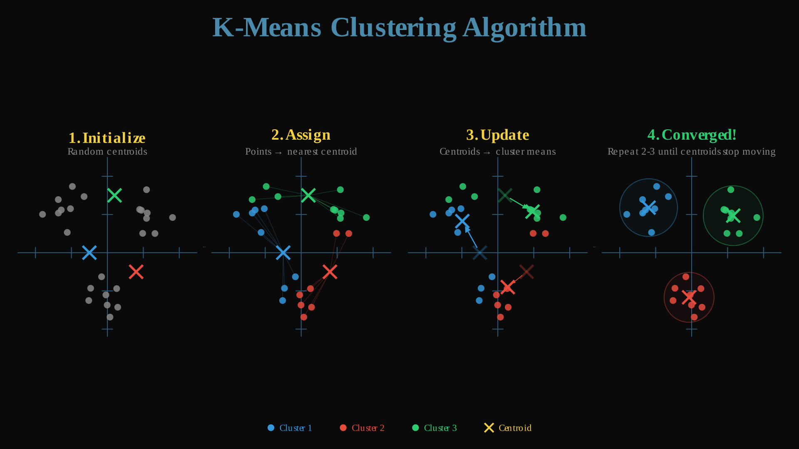

# SmolML - K-Means: Finding Groups in Your Data!

So far, we've looked at models that learn from labeled data (**supervised learning**): predicting house prices (*regression*) or classifying images (*classification*). But what if you just have a big pile of data and no labels? How can you find interesting structures or groups within it? Welcome to **Unsupervised Learning**, and one of its most popular tools: **K-Means Clustering**!

Imagine you have data points scattered on a graph. K-Means tries to automatically group these points into a specified number (`k`) of clusters, without any prior knowledge of what those groups should be. An example of this could be trying to find natural groupings of customers based on their purchasing behavior, or grouping stars based on their brightness and temperature.

## K-Means Algorithm

<div align="center">

  
  
</div>

K-Means aims to partition your data into `k` distinct, non-overlapping clusters. It does this by finding `k` central points, called **centroids**, and assigning each data point to the nearest centroid. The core idea is an iterative process that alternates between assigning points and updating the centers.

Before we dive in, let's set up our `KMeans` class with the parameters we need:

```python
class KMeans:
    def __init__(self, n_clusters, max_iters, tol) -> None:
        self.n_clusters = n_clusters  # How many clusters to find (k)
        self.max_iters = max_iters    # Maximum iterations before stopping
        self.tol = tol                # Convergence tolerance
        self.centroids = None         # Will hold the k centroid positions
        self.labels_ = None           # Will hold cluster assignment for each point
        self.centroid_history = []    # Track how centroids move (useful for visualization)
```

Now let's walk through each step of the algorithm!

### Step 1: Initialization - Pick Starting Points

First, we need initial guesses for the location of the `k` cluster centroids. A common approach (and the one we use here) is to simply pick `k` random data points from your dataset. Think of this as randomly dropping `k` pins on our data map.

```python
def _initialize_centroids(self, X_train):
    """Randomly select k points from the data as initial centroids."""
    centroids = random.sample(X_train.to_list(), self.n_clusters)
    self.centroids = MLArray(centroids)
    self.centroid_history = [self.centroids.to_list()]
    return self.centroids
```

We use `random.sample` to pick `n_clusters` distinct points from our training data. These become our starting centroids. We also initialize `centroid_history` to track how these centers move over iterations (handy for visualization!).

### Step 2: Assignment Step - Find Your Closest Center

Now, for *every* data point, we calculate its distance to *each* of the `k` centroids. The most common distance measure is **Euclidean distance** (straight-line distance). Each point gets assigned to the cluster whose centroid it's closest to.

First, we need to compute all the distances:

```python
def _compute_distances(self, X_train):
    """Compute Euclidean distances between all points and all centroids."""
    # Reshape X to (n_samples, 1, n_features) for broadcasting
    diff = X_train.reshape(-1, 1, X_train.shape[1]) - self.centroids
    squared_diff = diff * diff
    squared_distances = squared_diff.sum(axis=2)
    distances = squared_distances.sqrt()
    return distances
```

This uses `MLArray`'s broadcasting to compute all distances at once! The reshape trick lets us subtract each centroid from each point in one operation. The result is a matrix of shape `(n_samples, n_clusters)` where entry `[i, j]` is the distance from point `i` to centroid `j`.

Now we assign each point to its nearest centroid:

```python
def _assign_clusters(self, distance_matrix):
    """Assign each point to its nearest centroid."""
    distances = distance_matrix.to_list()
    labels = []

    for sample_distances in distances:
        min_distance = float('inf')
        min_index = 0

        # Find the closest centroid
        for cluster_idx, distance in enumerate(sample_distances):
            if distance < min_distance:
                min_distance = distance
                min_index = cluster_idx

        labels.append(min_index)

    self.labels_ = MLArray(labels)
    return self.labels_
```

For each point, we look through its distances to all centroids and pick the one with the minimum distance. The result is a list of labels where `labels[i]` tells us which cluster point `i` belongs to.

### Step 3: Update Step - Move the Centers

The initial centroids were just random guesses. Now that we have points assigned to clusters, we can calculate *better* centroid locations.

For each cluster, we find the new centroid by calculating the **mean** (average position) of all data points assigned to that cluster. Imagine finding the "center of gravity" for all points in a cluster.

```python
def _update_centroids(self, X_train):
    """Update centroids to be the mean of their assigned points."""
    X_data = X_train.to_list()
    labels = self.labels_.to_list()
    new_centroids = []

    for cluster_idx in range(self.n_clusters):
        # Gather all points belonging to this cluster
        cluster_points = []
        for point_idx, label in enumerate(labels):
            if label == cluster_idx:
                cluster_points.append(X_data[point_idx])

        if cluster_points:
            # Compute the mean for each feature dimension
            centroid = []
            n_features = len(cluster_points[0])
            for feature_idx in range(n_features):
                feature_sum = sum(point[feature_idx] for point in cluster_points)
                feature_mean = feature_sum / len(cluster_points)
                centroid.append(feature_mean)
            new_centroids.append(centroid)
        else:
            # Empty cluster: keep the old centroid position
            new_centroids.append(self.centroids.to_list()[cluster_idx])

    old_centroids = self.centroids
    self.centroids = MLArray(new_centroids)
    self.centroid_history.append(new_centroids)

    # Check for convergence: did centroids move less than tolerance?
    if old_centroids is not None:
        diff = self.centroids - old_centroids
        movement = (diff * diff).sum().sqrt()
        return movement.data < self.tol

    return False
```

A few things happening here:

1. We collect all points that were assigned to each cluster.
2. For each cluster, we average across all dimensions to get the new centroid position.
3. If a cluster has no points (can happen with unlucky initialization), we keep its centroid where it was.
4. We compute how much the centroids moved. If the total movement is less than our tolerance `tol`, we've converged!

### Step 4: Repeat Until Convergence

Now we put it all together in the main training loop:

```python
def fit(self, X_train):
    """Main K-Means training loop."""
    self.centroids = self._initialize_centroids(X_train)

    for _ in range(self.max_iters):
        # Step 2: Assign points to nearest centroid
        distances = self._compute_distances(X_train)
        self.labels_ = self._assign_clusters(distances)

        # Step 3: Update centroids to cluster means
        has_converged = self._update_centroids(X_train)

        # Stop if centroids stopped moving
        if has_converged:
            break

    return self
```

The algorithm keeps iterating until one of these happens:
- **Centroids settle down**: The total movement is less than our tolerance `tol`.
- **Maximum iterations reached**: We hit `max_iters` to prevent running forever.

### Making Predictions

Once trained, we can assign new points to the nearest learned centroid:

```python
def predict(self, X):
    """Predict cluster assignments for new data points."""
    if self.centroids is None:
        raise ValueError("Model has not been fitted yet.")

    distances = self._compute_distances(X)
    return self._assign_clusters(distances)
```

We simply compute distances to our learned centroids and assign each point to the nearest one. We also provide a convenience method `fit_predict` that trains and predicts in one step:

```python
def fit_predict(self, X_train):
    """Fit the model and return cluster labels for training data."""
    return self.fit(X_train).predict(X_train)
```

## Example Usage

Let's find 3 clusters in some simple 2D data:

```python
from smolml.models.unsupervised import KMeans
from smolml.core.ml_array import MLArray
import random

# Generate some synthetic 2D data around 3 centers
def generate_data(n_samples, centers):
    data = []
    for _ in range(n_samples):
        center = random.choice(centers)
        # Add some random noise around the center
        point = [center[0] + random.gauss(0, 0.5),
                 center[1] + random.gauss(0, 0.5)]
        data.append(point)
    return data

centers = [[2, 2], [8, 3], [5, 8]]
X_data = generate_data(150, centers)

# Convert to MLArray
X = MLArray(X_data)

# Initialize and fit K-Means
k = 3  # We want to find 3 clusters
kmeans = KMeans(n_clusters=k, max_iters=100, tol=1e-4)

print("Fitting K-Means...")
kmeans.fit(X)

# Get the results
final_centroids = kmeans.centroids
cluster_labels = kmeans.labels_

print("\nK-Means fitting complete!")
print(f"Final Centroid positions:\n{final_centroids}")
print(f"Number of points in each cluster:")
labels_list = cluster_labels.to_list()
for i in range(k):
    print(f"  Cluster {i}: {labels_list.count(i)} points")

# Predict the cluster for a new point
new_point = MLArray([[6, 6]])
predicted_cluster = kmeans.predict(new_point)
print(f"\nNew point {new_point.to_list()} assigned to cluster: {predicted_cluster.to_list()[0]}")
```

> **Note**: Because K-Means starts with random initial centroids, you might get slightly different clustering results each time you run it. Running it multiple times and choosing the best result based on some metric (like inertia) is a common practice.


And that's it! This elegant simplicity is what makes K-Means such a great first step into the world of unsupervised learning. For our next section, we will step a bit back from models and will focus more on relevant tools, such as our scalers!

[Next Section: Preprocessing](https://github.com/rodmarkun/SmolML/tree/main/smolml/preprocessing)

## Resouces & Readings

- [Video - K-Means Clustering - 5 Minutes with Cyrill](https://www.youtube.com/watch?v=-cI8l3K9dxI&t=101s)
